<h1 align="center">
  123 Scientific Diagrams
</h1>

<h4 align="center">
  Illustrating concepts in physics, chemistry and machine learning.
</h4>

<h3 align="center">

[](https://diagrams.janosh.dev?tag=cetz)
[](https://diagrams.janosh.dev?tag=tikz)
[](https://github.com/janosh/diagrams/actions/workflows/ci.yml)
[](https://github.com/janosh/diagrams/pulls)
[](https://zenodo.org/badge/latestdoi/286220365)

</h3>

[janosh.github.io/diagrams](https://janosh.github.io/diagrams) allows searching, sorting, opening in Overleaf and downloading figures (PDF/SVG/PNG) from this collection.

Have a TikZ/CeTZ diagram you'd like to share? [Submit a PR](https://github.com/janosh/diagrams/pulls) with a `.tex` or `.typ` and a corresponding metadata `.yml` file in the `assets/` directory and add yourself to the [`citation.cff`](citation.cff) file.

<!-- diagram-table -->

| &emsp;&emsp;&emsp;&emsp;&emsp;&emsp;&emsp;&emsp;&emsp;&emsp;&emsp;&emsp;&emsp;&emsp;&emsp;&emsp;&emsp;&emsp;&emsp;&emsp;&emsp;&emsp; | &emsp;&emsp;&emsp;&emsp;&emsp;&emsp;&emsp;&emsp;&emsp;&emsp;&emsp;&emsp;&emsp;&emsp;&emsp;&emsp;&emsp;&emsp;&emsp;&emsp;&emsp;&emsp; |
| :---: | :---: |
| [2d Convolution](https://janosh.github.io/diagrams/2d-convolution) &nbsp;[![LaTeX][latex-logo]](assets/2d-convolution/2d-convolution.tex)&nbsp;[![Typst][typst-logo]](assets/2d-convolution/2d-convolution.typ) | [Amplitude vs Frequency Modulation](https://janosh.github.io/diagrams/amplitude-vs-frequency-modulation) &nbsp;[![Typst][typst-logo]](assets/amplitude-vs-frequency-modulation/amplitude-vs-frequency-modulation.typ) |
| 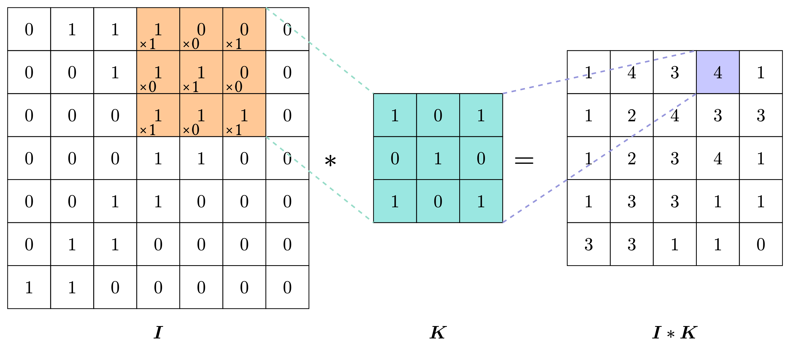 | 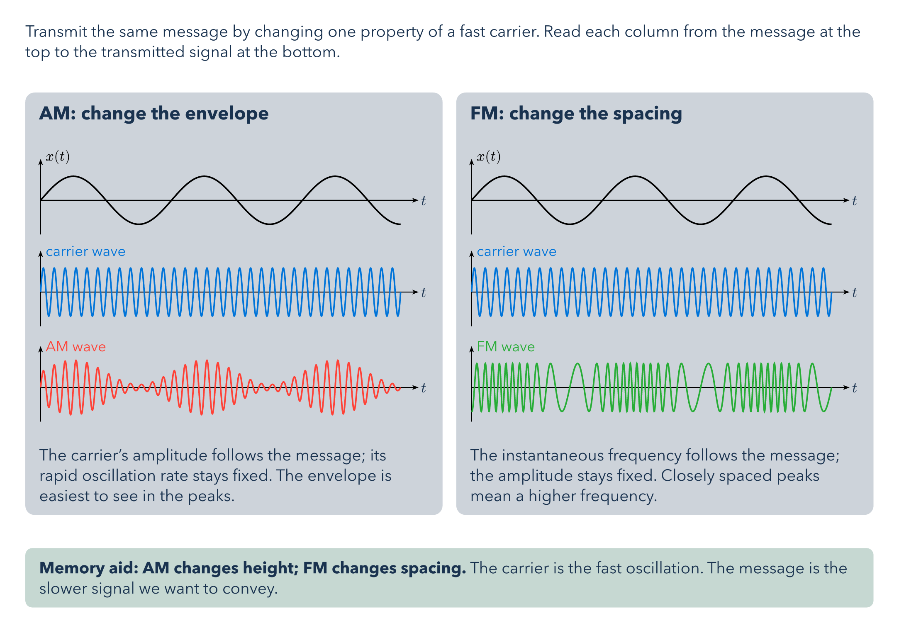 |
| [Angular Momentum Quantization](https://janosh.github.io/diagrams/angular-momentum-quantization) &nbsp;[![Typst][typst-logo]](assets/angular-momentum-quantization/angular-momentum-quantization.typ) | [Atomistic Simulation Methods](https://janosh.github.io/diagrams/atomistic-simulation-methods) &nbsp;[![Typst][typst-logo]](assets/atomistic-simulation-methods/atomistic-simulation-methods.typ) |
| 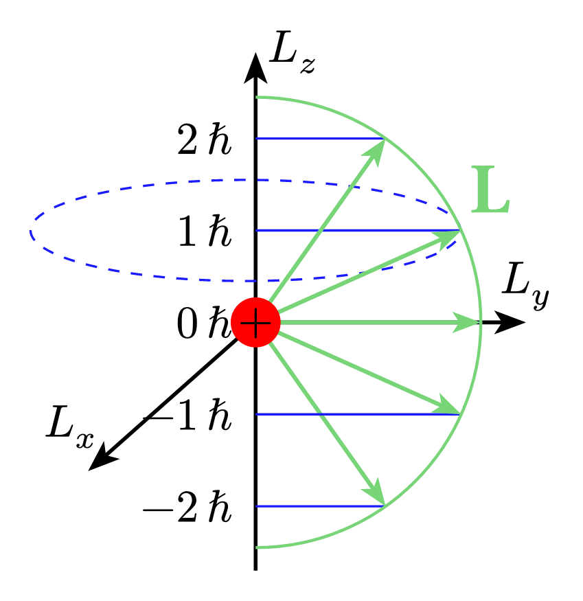 | 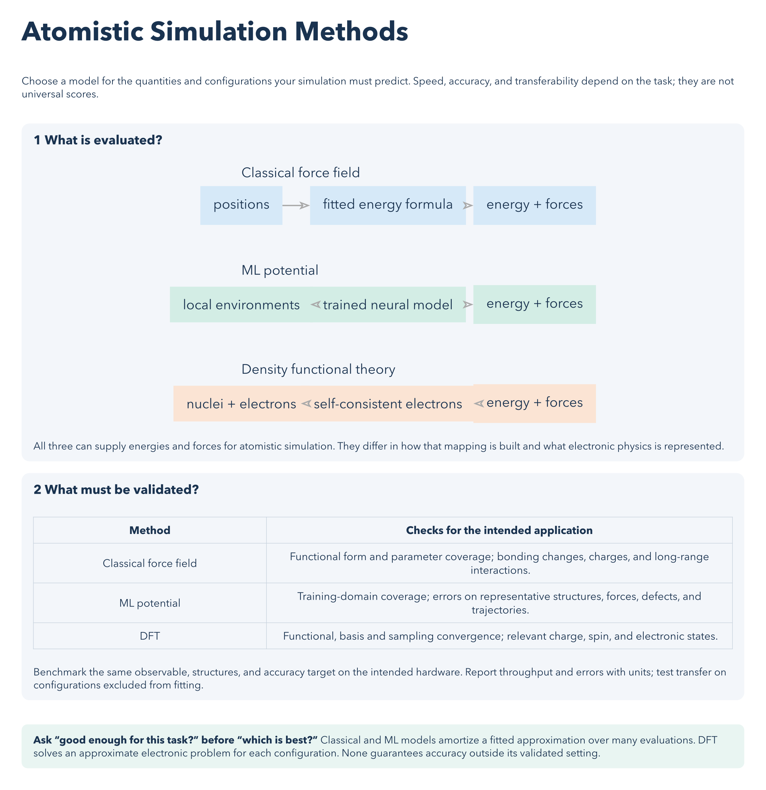 |
| [Autoencoder Architectures](https://janosh.github.io/diagrams/autoencoder-architectures) &nbsp;[![Typst][typst-logo]](assets/autoencoder-architectures/autoencoder-architectures.typ) | [Ball Tree](https://janosh.github.io/diagrams/ball-tree) &nbsp;[![Typst][typst-logo]](assets/ball-tree/ball-tree.typ) |
| 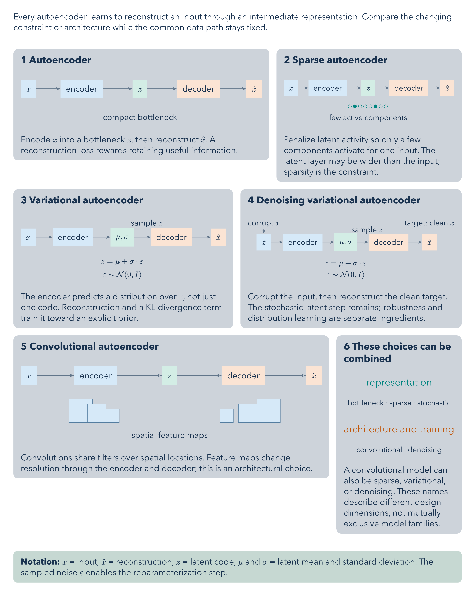 | 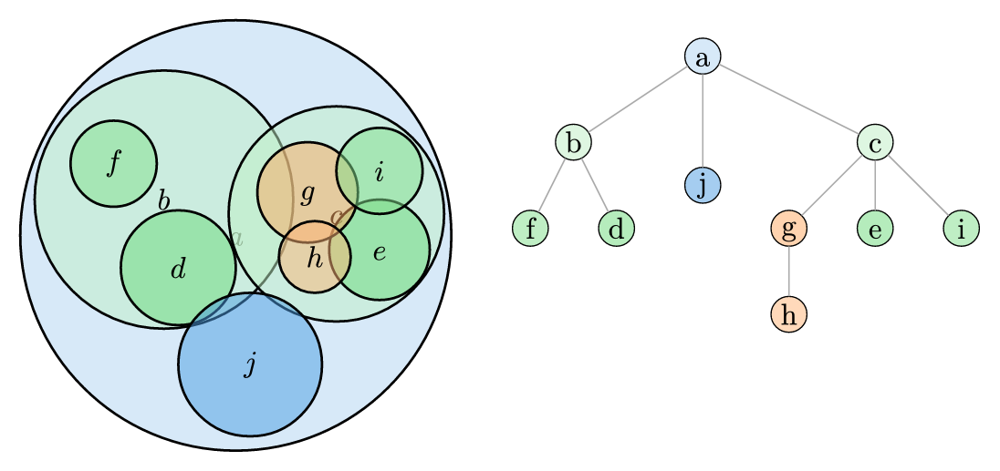 |
| [Basis + Lattice](https://janosh.github.io/diagrams/basis-plus-lattice) &nbsp;[![LaTeX][latex-logo]](assets/basis-plus-lattice/basis-plus-lattice.tex)&nbsp;[![Typst][typst-logo]](assets/basis-plus-lattice/basis-plus-lattice.typ) | [Bloch Sphere](https://janosh.github.io/diagrams/bloch-sphere) &nbsp;[![LaTeX][latex-logo]](assets/bloch-sphere/bloch-sphere.tex)&nbsp;[![Typst][typst-logo]](assets/bloch-sphere/bloch-sphere.typ) |
| 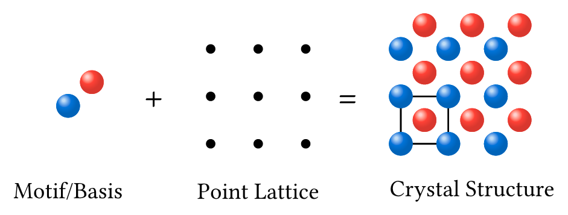 | 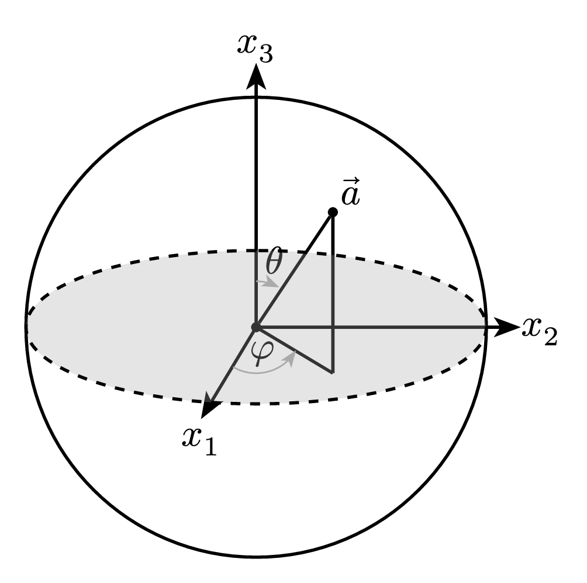 |
| [Bose Einstein Distribution 3d](https://janosh.github.io/diagrams/bose-einstein-distribution-3d) &nbsp;[![LaTeX][latex-logo]](assets/bose-einstein-distribution-3d/bose-einstein-distribution-3d.tex)&nbsp;[![Typst][typst-logo]](assets/bose-einstein-distribution-3d/bose-einstein-distribution-3d.typ) | [Branch and Bound](https://janosh.github.io/diagrams/branch-and-bound) &nbsp;[![LaTeX][latex-logo]](assets/branch-and-bound/branch-and-bound.tex)&nbsp;[![Typst][typst-logo]](assets/branch-and-bound/branch-and-bound.typ) |
| 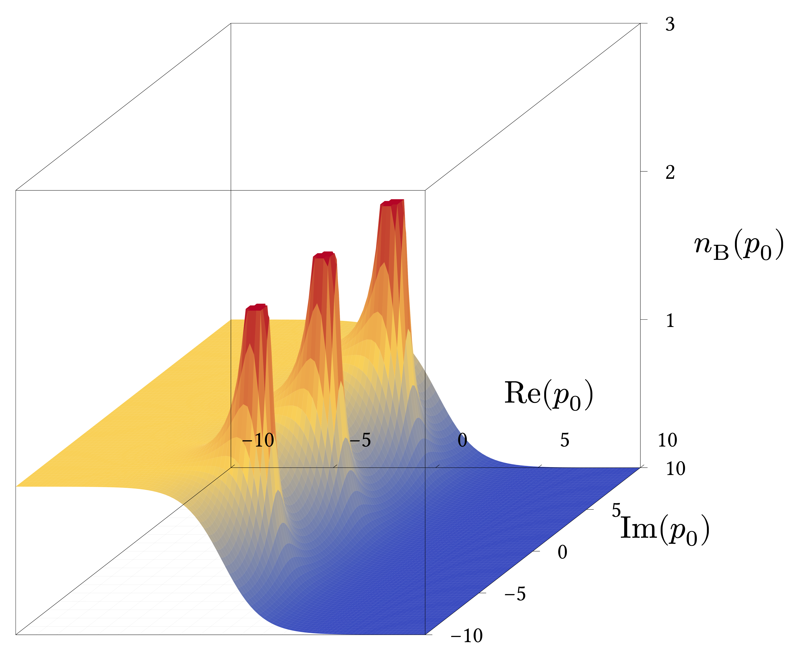 | 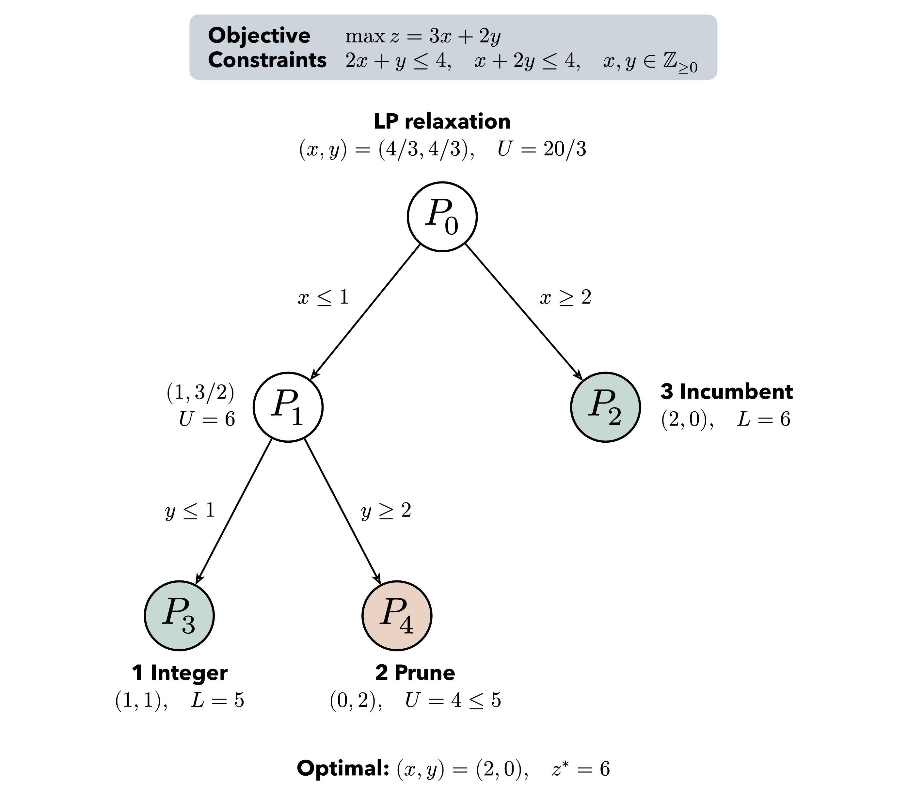 |
| [Branch Cuts 1](https://janosh.github.io/diagrams/branch-cuts-1) &nbsp;[![LaTeX][latex-logo]](assets/branch-cuts-1/branch-cuts-1.tex)&nbsp;[![Typst][typst-logo]](assets/branch-cuts-1/branch-cuts-1.typ) | [Branch Cuts 2](https://janosh.github.io/diagrams/branch-cuts-2) &nbsp;[![LaTeX][latex-logo]](assets/branch-cuts-2/branch-cuts-2.tex)&nbsp;[![Typst][typst-logo]](assets/branch-cuts-2/branch-cuts-2.typ) |
| 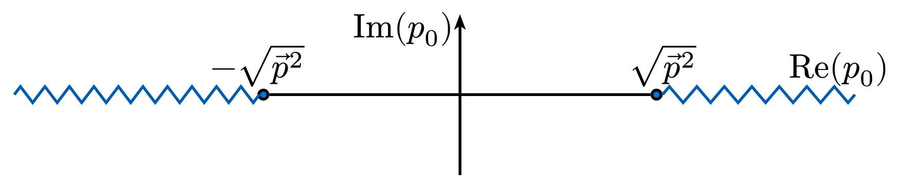 | 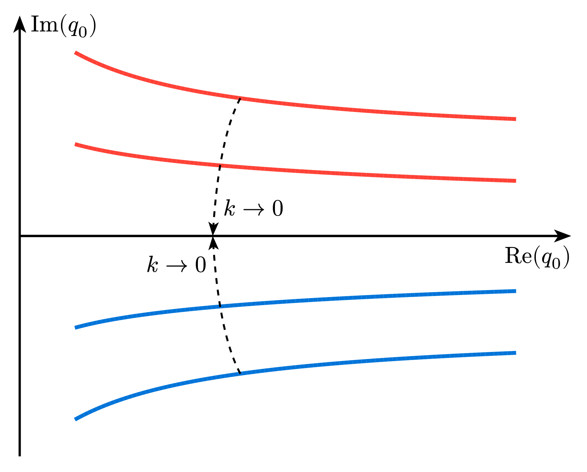 |
| [Burrows-Wheeler Transform](https://janosh.github.io/diagrams/burrows-wheeler-transform) &nbsp;[![LaTeX][latex-logo]](assets/burrows-wheeler-transform/burrows-wheeler-transform.tex)&nbsp;[![Typst][typst-logo]](assets/burrows-wheeler-transform/burrows-wheeler-transform.typ) | [Cartesian vs Polar Coordinates](https://janosh.github.io/diagrams/cartesian-vs-polar-coordinates) &nbsp;[![LaTeX][latex-logo]](assets/cartesian-vs-polar-coordinates/cartesian-vs-polar-coordinates.tex)&nbsp;[![Typst][typst-logo]](assets/cartesian-vs-polar-coordinates/cartesian-vs-polar-coordinates.typ) |
|  | 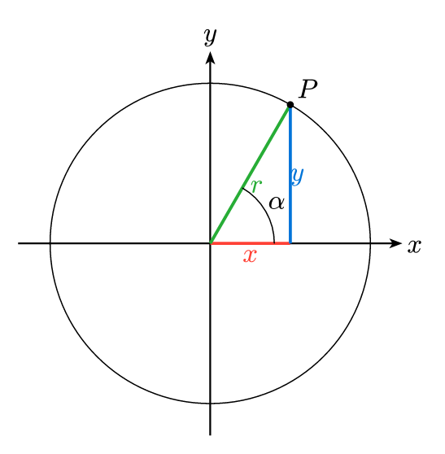 |
| [Chain Homology](https://janosh.github.io/diagrams/chain-homology) &nbsp;[![Typst][typst-logo]](assets/chain-homology/chain-homology.typ) | [Change of Variables](https://janosh.github.io/diagrams/change-of-variables) &nbsp;[![LaTeX][latex-logo]](assets/change-of-variables/change-of-variables.tex)&nbsp;[![Typst][typst-logo]](assets/change-of-variables/change-of-variables.typ) |
| 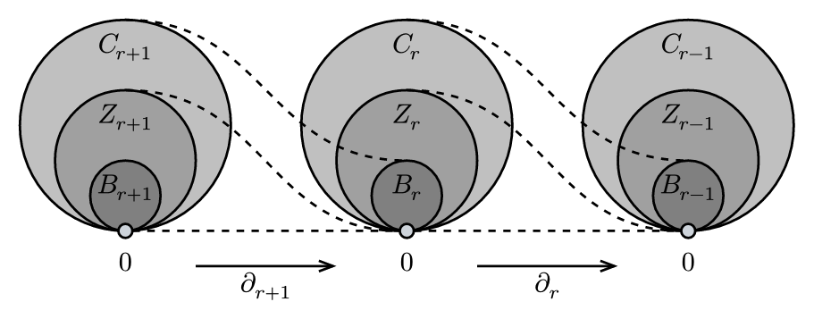 | 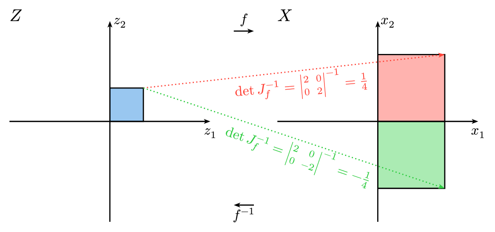 |
| [Complex Sign Function](https://janosh.github.io/diagrams/complex-sign-function) &nbsp;[![Typst][typst-logo]](assets/complex-sign-function/complex-sign-function.typ) | [Convex Hull of Stability](https://janosh.github.io/diagrams/convex-hull-of-stability) &nbsp;[![LaTeX][latex-logo]](assets/convex-hull-of-stability/convex-hull-of-stability.tex)&nbsp;[![Typst][typst-logo]](assets/convex-hull-of-stability/convex-hull-of-stability.typ) |
| 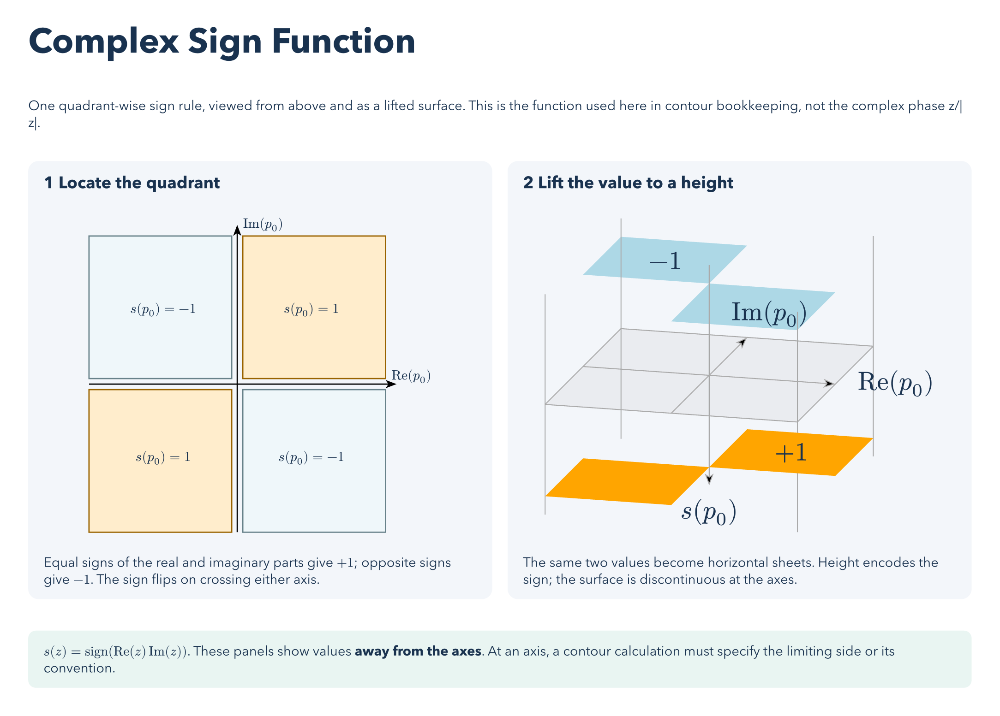 | 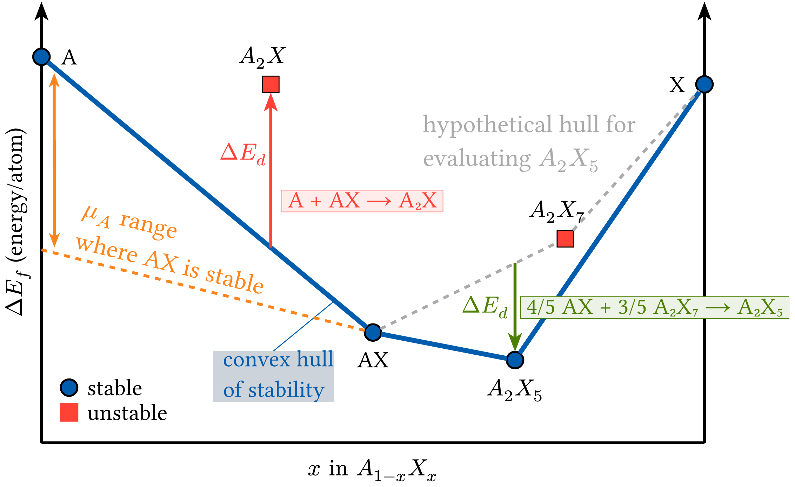 |
| [Convexity and Jensen’s Inequality](https://janosh.github.io/diagrams/convexity-and-jensens-inequality) &nbsp;[![Typst][typst-logo]](assets/convexity-and-jensens-inequality/convexity-and-jensens-inequality.typ) | [Critical Temperature](https://janosh.github.io/diagrams/critical-temperature) &nbsp;[![LaTeX][latex-logo]](assets/critical-temperature/critical-temperature.tex)&nbsp;[![Typst][typst-logo]](assets/critical-temperature/critical-temperature.typ) |
| 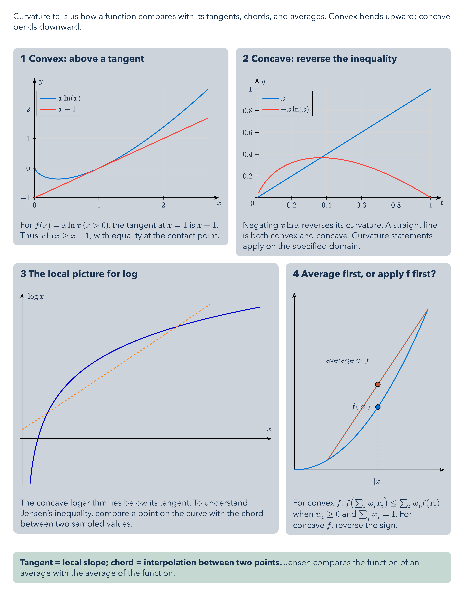 | 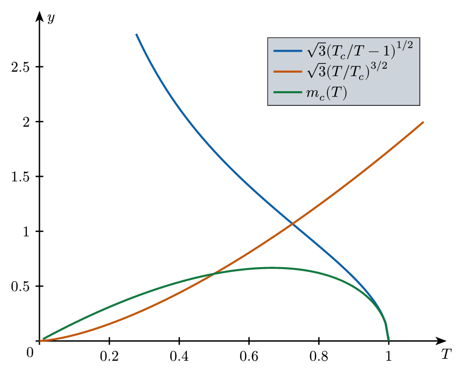 |
| [CycleGAN](https://janosh.github.io/diagrams/cyclegan) &nbsp;[![LaTeX][latex-logo]](assets/cyclegan/cyclegan.tex)&nbsp;[![Typst][typst-logo]](assets/cyclegan/cyclegan.typ) | [Cylinder to Plane](https://janosh.github.io/diagrams/cylinder-to-plane) &nbsp;[![LaTeX][latex-logo]](assets/cylinder-to-plane/cylinder-to-plane.tex)&nbsp;[![Typst][typst-logo]](assets/cylinder-to-plane/cylinder-to-plane.typ) |
| 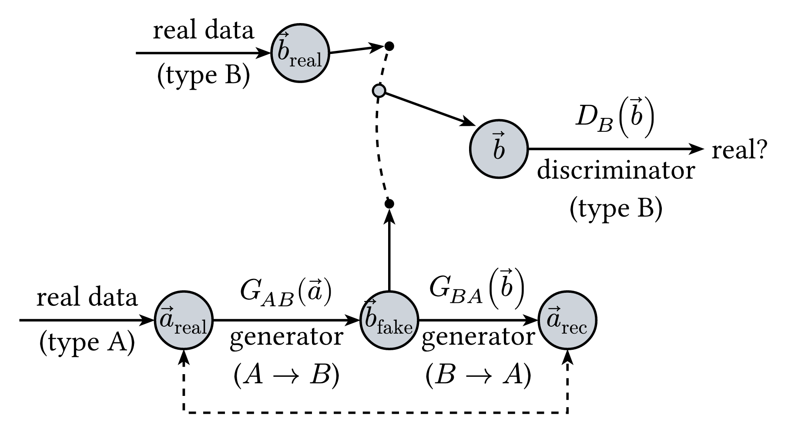 |  |
| [De Bruijn Graph](https://janosh.github.io/diagrams/de-bruijn-graph) &nbsp;[![LaTeX][latex-logo]](assets/de-bruijn-graph/de-bruijn-graph.tex)&nbsp;[![Typst][typst-logo]](assets/de-bruijn-graph/de-bruijn-graph.typ) | [Deep Belief Network](https://janosh.github.io/diagrams/deep-belief-network) &nbsp;[![LaTeX][latex-logo]](assets/deep-belief-network/deep-belief-network.tex)&nbsp;[![Typst][typst-logo]](assets/deep-belief-network/deep-belief-network.typ) |
| 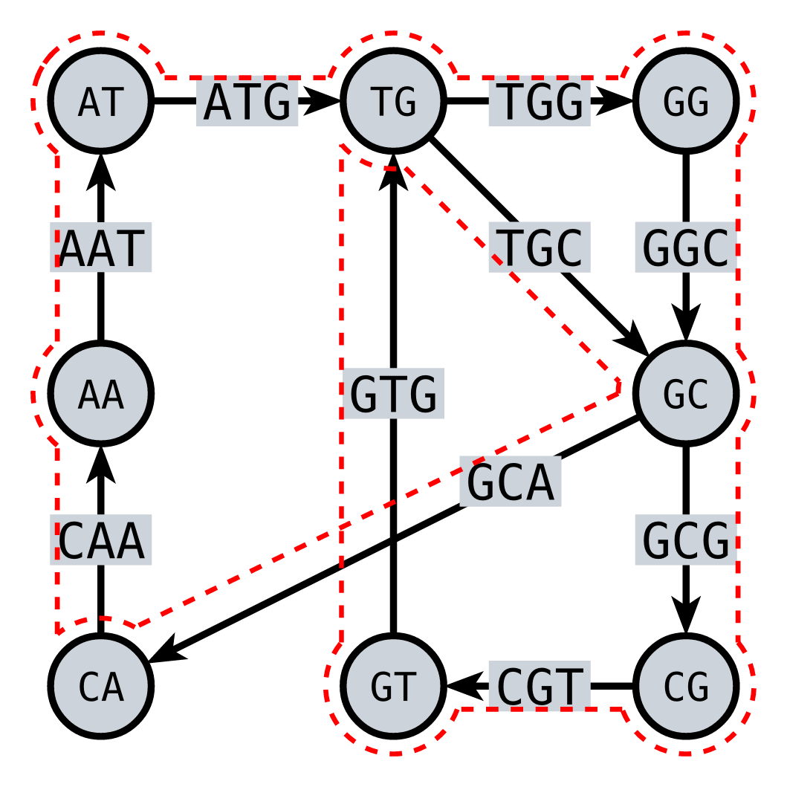 | 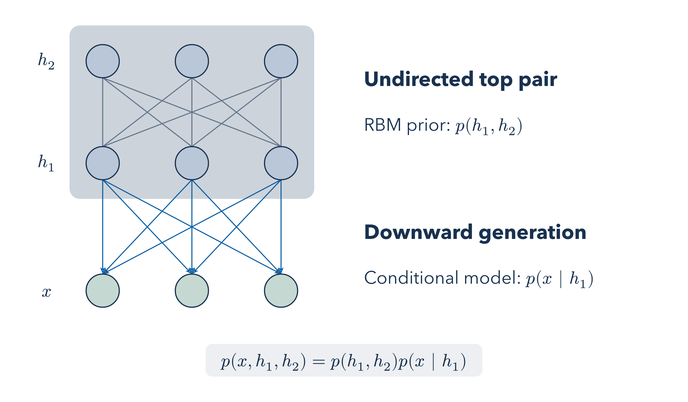 |
| [DFT Choices](https://janosh.github.io/diagrams/dft-choices) &nbsp;[![LaTeX][latex-logo]](assets/dft-choices/dft-choices.tex)&nbsp;[![Typst][typst-logo]](assets/dft-choices/dft-choices.typ) | [DFT Jacob's Ladder](https://janosh.github.io/diagrams/dft-jacobs-ladder) &nbsp;[![Typst][typst-logo]](assets/dft-jacobs-ladder/dft-jacobs-ladder.typ) |
| 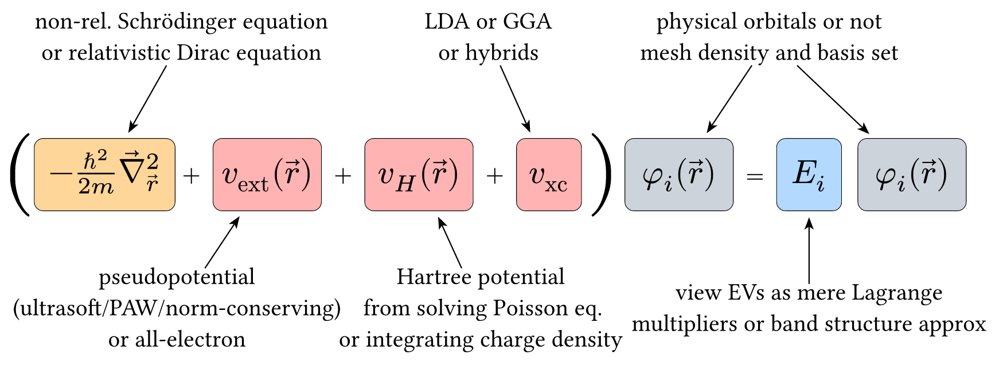 | 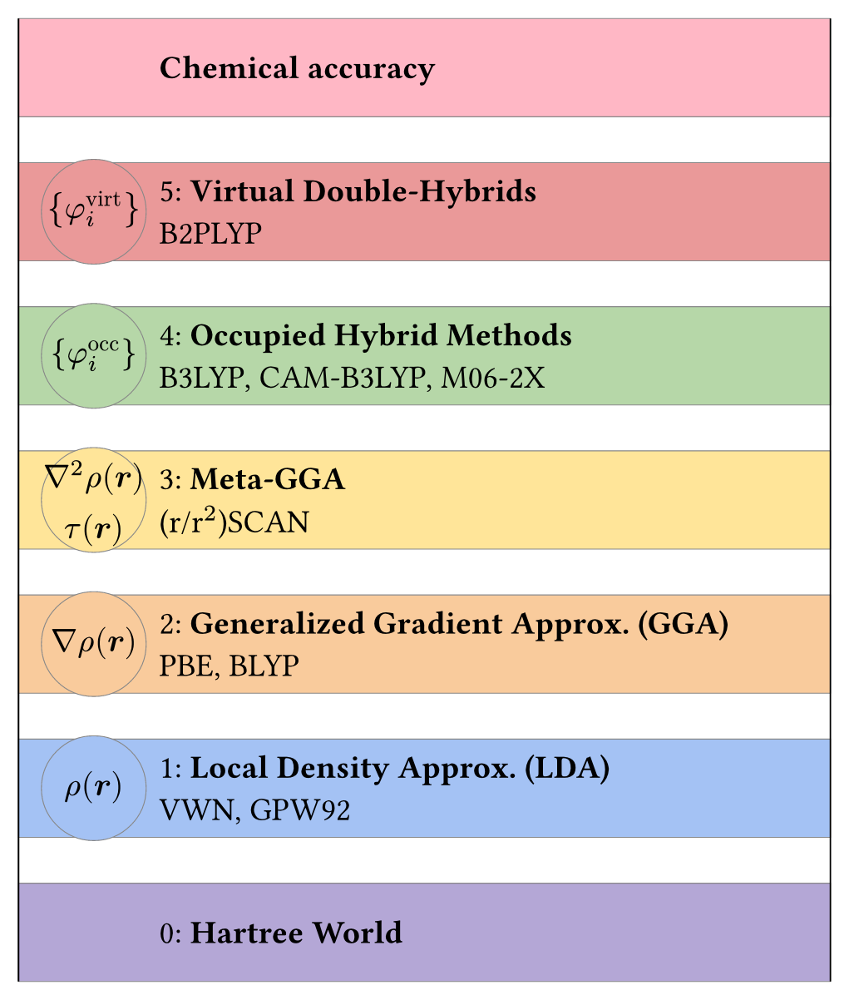 |
| [Disk to Plane](https://janosh.github.io/diagrams/disk-to-plane) &nbsp;[![LaTeX][latex-logo]](assets/disk-to-plane/disk-to-plane.tex)&nbsp;[![Typst][typst-logo]](assets/disk-to-plane/disk-to-plane.typ) | [DNA Double Helix](https://janosh.github.io/diagrams/dna-double-helix) &nbsp;[![LaTeX][latex-logo]](assets/dna-double-helix/dna-double-helix.tex)&nbsp;[![Typst][typst-logo]](assets/dna-double-helix/dna-double-helix.typ) |
| 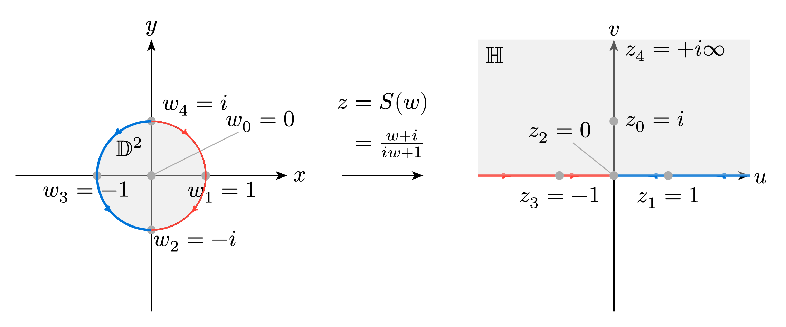 | 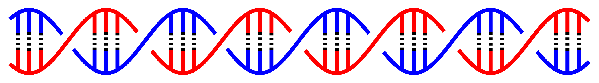 |
| [Dropout](https://janosh.github.io/diagrams/dropout) &nbsp;[![LaTeX][latex-logo]](assets/dropout/dropout.tex)&nbsp;[![Typst][typst-logo]](assets/dropout/dropout.typ) | [Ergodic](https://janosh.github.io/diagrams/ergodic) &nbsp;[![LaTeX][latex-logo]](assets/ergodic/ergodic.tex)&nbsp;[![Typst][typst-logo]](assets/ergodic/ergodic.typ) |
| 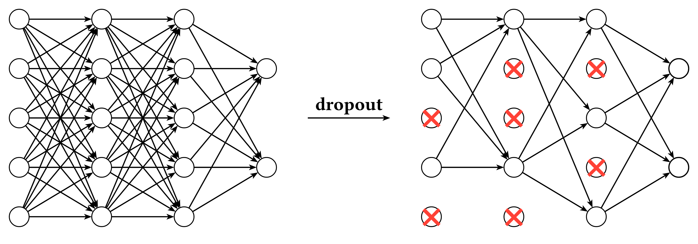 | 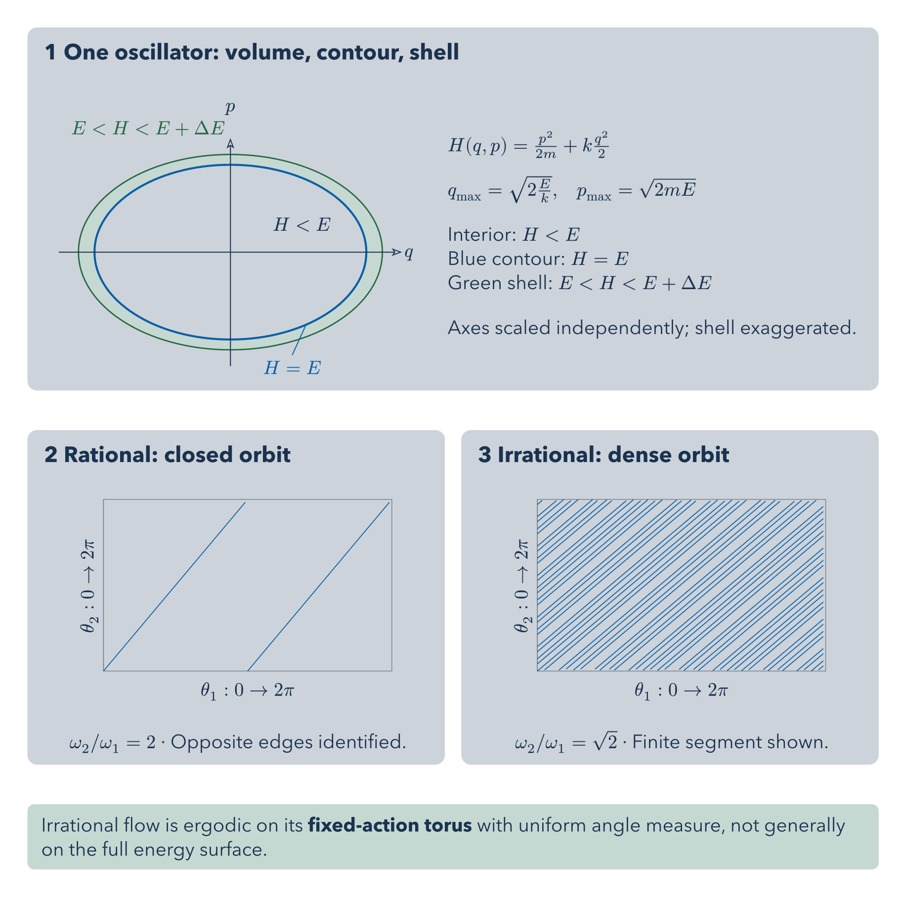 |
| [Euler Angles](https://janosh.github.io/diagrams/euler-angles) &nbsp;[![LaTeX][latex-logo]](assets/euler-angles/euler-angles.tex)&nbsp;[![Typst][typst-logo]](assets/euler-angles/euler-angles.typ) | [Ferroelectric Response](https://janosh.github.io/diagrams/ferroelectric-response) &nbsp;[![LaTeX][latex-logo]](assets/ferroelectric-response/ferroelectric-response.tex)&nbsp;[![Typst][typst-logo]](assets/ferroelectric-response/ferroelectric-response.typ) |
| 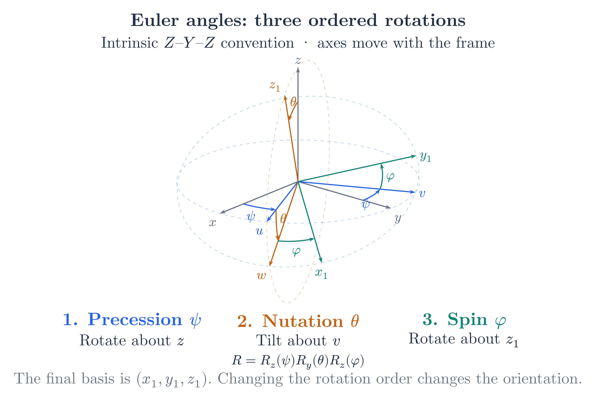 | 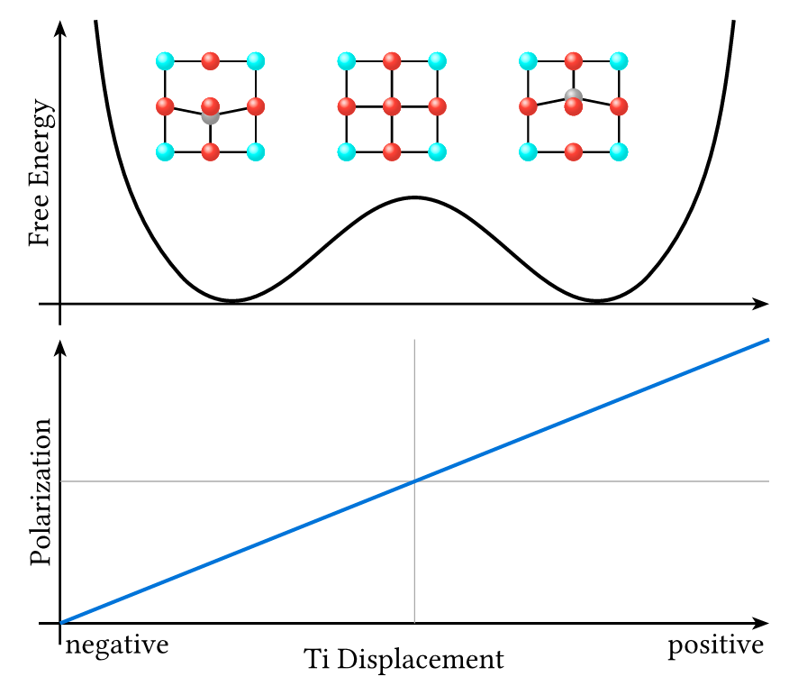 |
| [Feynman Building Blocks](https://janosh.github.io/diagrams/feynman-building-blocks) &nbsp;[![Typst][typst-logo]](assets/feynman-building-blocks/feynman-building-blocks.typ) | [Feynman Diagram Loop](https://janosh.github.io/diagrams/feynman-diagram-loop) &nbsp;[![LaTeX][latex-logo]](assets/feynman-diagram-loop/feynman-diagram-loop.tex)&nbsp;[![Typst][typst-logo]](assets/feynman-diagram-loop/feynman-diagram-loop.typ) |
| 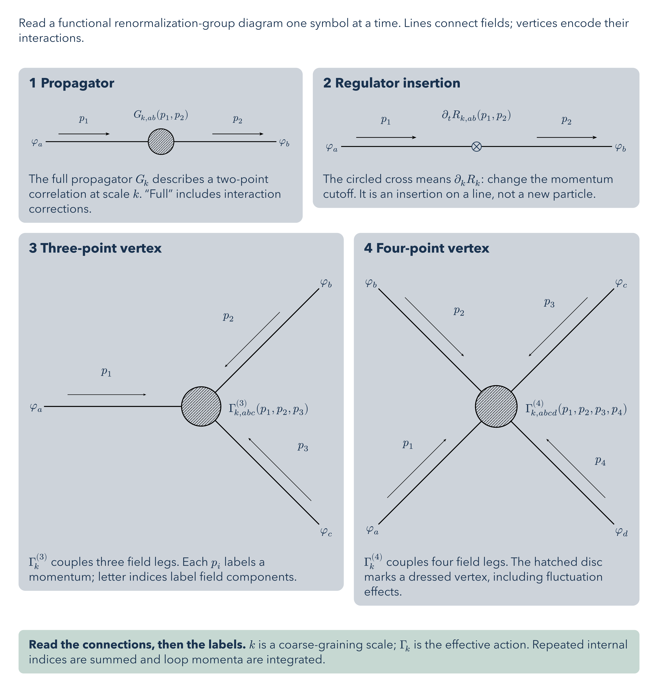 |  |
| [Feynman Diagram One Point](https://janosh.github.io/diagrams/feynman-diagram-one-point) &nbsp;[![LaTeX][latex-logo]](assets/feynman-diagram-one-point/feynman-diagram-one-point.tex)&nbsp;[![Typst][typst-logo]](assets/feynman-diagram-one-point/feynman-diagram-one-point.typ) | [Feynman Diagram Propagator Loop](https://janosh.github.io/diagrams/feynman-diagram-propagator-loop) &nbsp;[![LaTeX][latex-logo]](assets/feynman-diagram-propagator-loop/feynman-diagram-propagator-loop.tex)&nbsp;[![Typst][typst-logo]](assets/feynman-diagram-propagator-loop/feynman-diagram-propagator-loop.typ) |
| 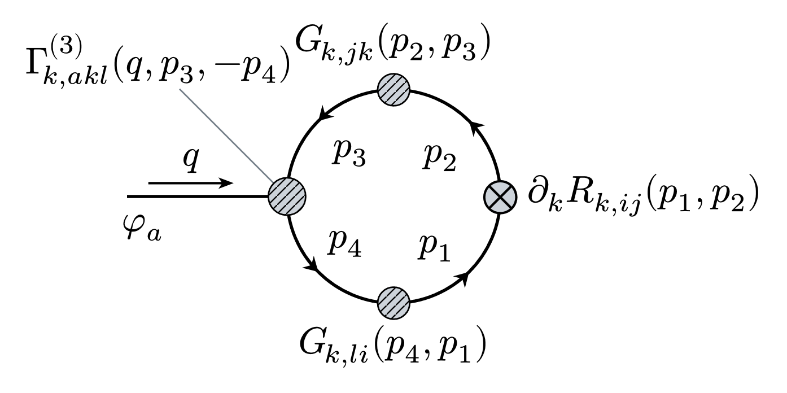 | 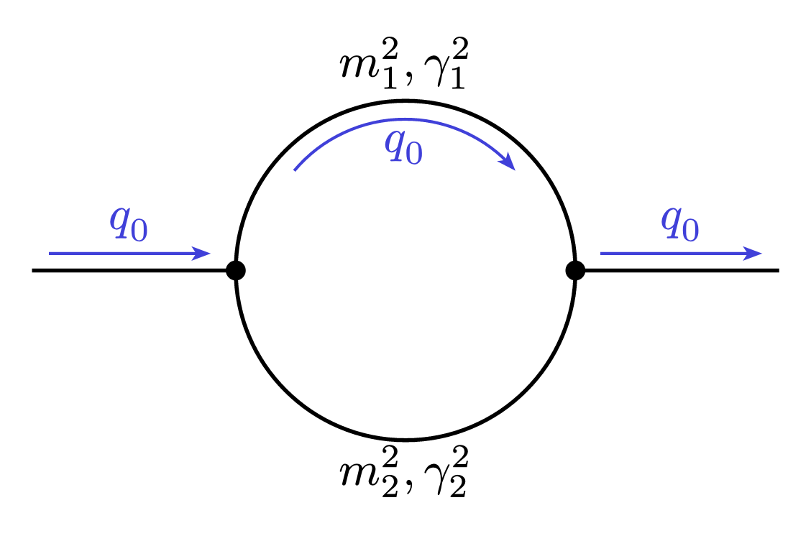 |
| [Feynman Diagrams Loop Regulator](https://janosh.github.io/diagrams/feynman-diagrams-loop-regulator) &nbsp;[![LaTeX][latex-logo]](assets/feynman-diagrams-loop-regulator/feynman-diagrams-loop-regulator.tex)&nbsp;[![Typst][typst-logo]](assets/feynman-diagrams-loop-regulator/feynman-diagrams-loop-regulator.typ) | [Fractal Atlas](https://janosh.github.io/diagrams/fractal-atlas) &nbsp;[![Typst][typst-logo]](assets/fractal-atlas/fractal-atlas.typ) |
| 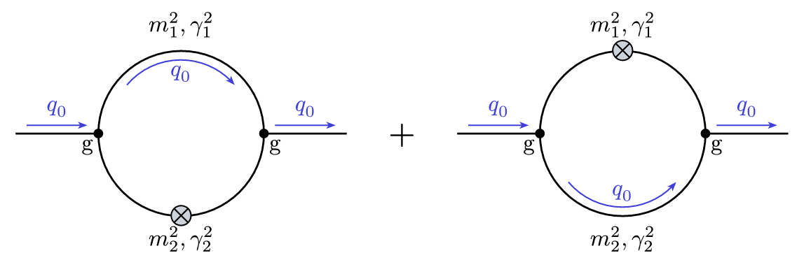 | 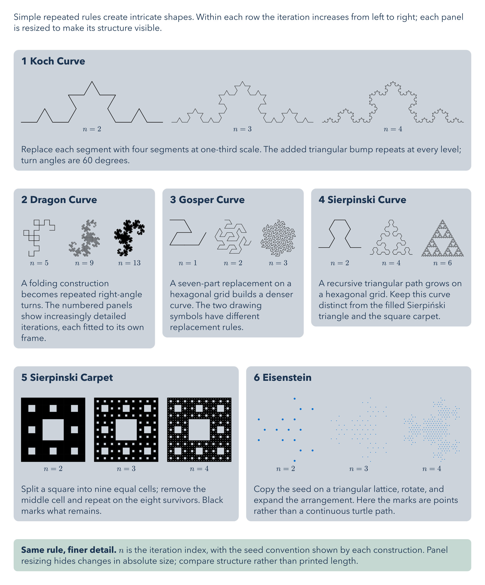 |
| [Gas Pressure on Wall](https://janosh.github.io/diagrams/gas-pressure-on-wall) &nbsp;[![LaTeX][latex-logo]](assets/gas-pressure-on-wall/gas-pressure-on-wall.tex)&nbsp;[![Typst][typst-logo]](assets/gas-pressure-on-wall/gas-pressure-on-wall.typ) | [Generative Adversarial Network](https://janosh.github.io/diagrams/generative-adversarial-network) &nbsp;[![LaTeX][latex-logo]](assets/generative-adversarial-network/generative-adversarial-network.tex)&nbsp;[![Typst][typst-logo]](assets/generative-adversarial-network/generative-adversarial-network.typ) |
| 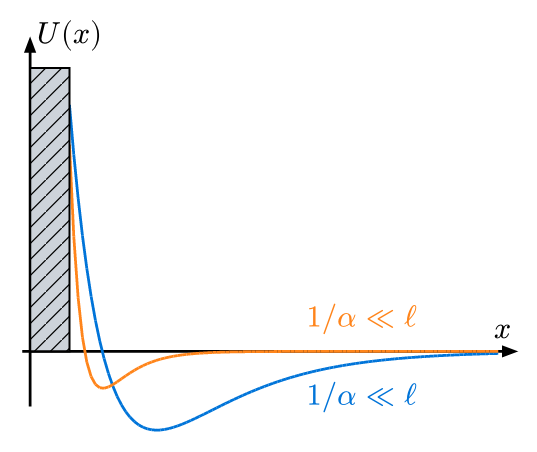 | 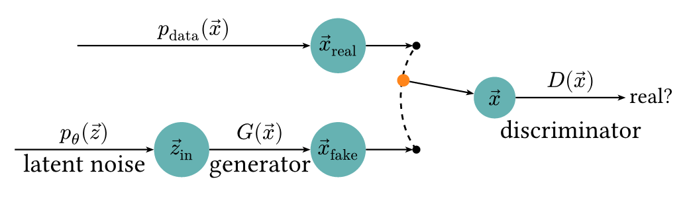 |
| [Geometric Bayes](https://janosh.github.io/diagrams/geometric-bayes) &nbsp;[![LaTeX][latex-logo]](assets/geometric-bayes/geometric-bayes.tex)&nbsp;[![Typst][typst-logo]](assets/geometric-bayes/geometric-bayes.typ) | [Gibbs Free Energy](https://janosh.github.io/diagrams/gibbs-free-energy) &nbsp;[![Typst][typst-logo]](assets/gibbs-free-energy/gibbs-free-energy.typ) |
| 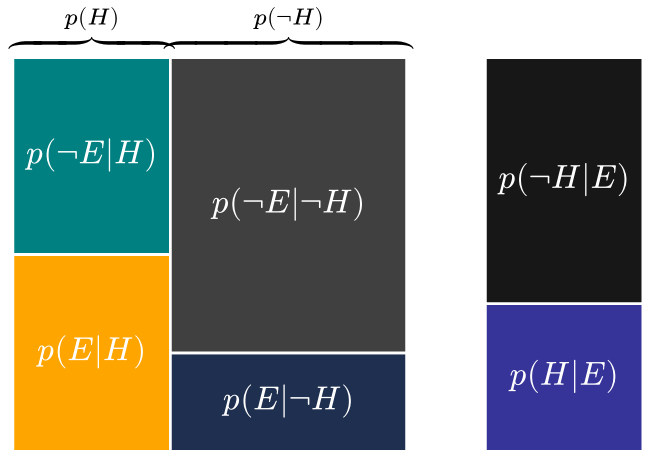 | 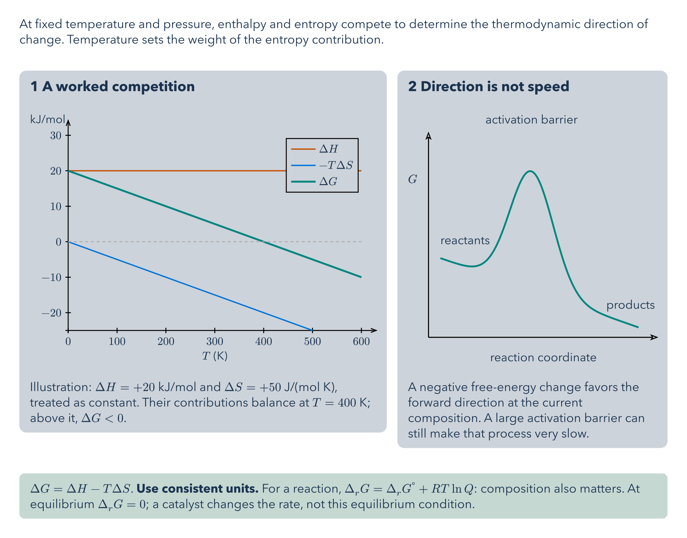 |
| [GPU Batching](https://janosh.github.io/diagrams/gpu-batching) &nbsp;[![Typst][typst-logo]](assets/gpu-batching/gpu-batching.typ) | [Grand Canonical Occupation Fluctuations](https://janosh.github.io/diagrams/grand-canonical-occupation-fluctuations) &nbsp;[![LaTeX][latex-logo]](assets/grand-canonical-occupation-fluctuations/grand-canonical-occupation-fluctuations.tex)&nbsp;[![Typst][typst-logo]](assets/grand-canonical-occupation-fluctuations/grand-canonical-occupation-fluctuations.typ) |
| 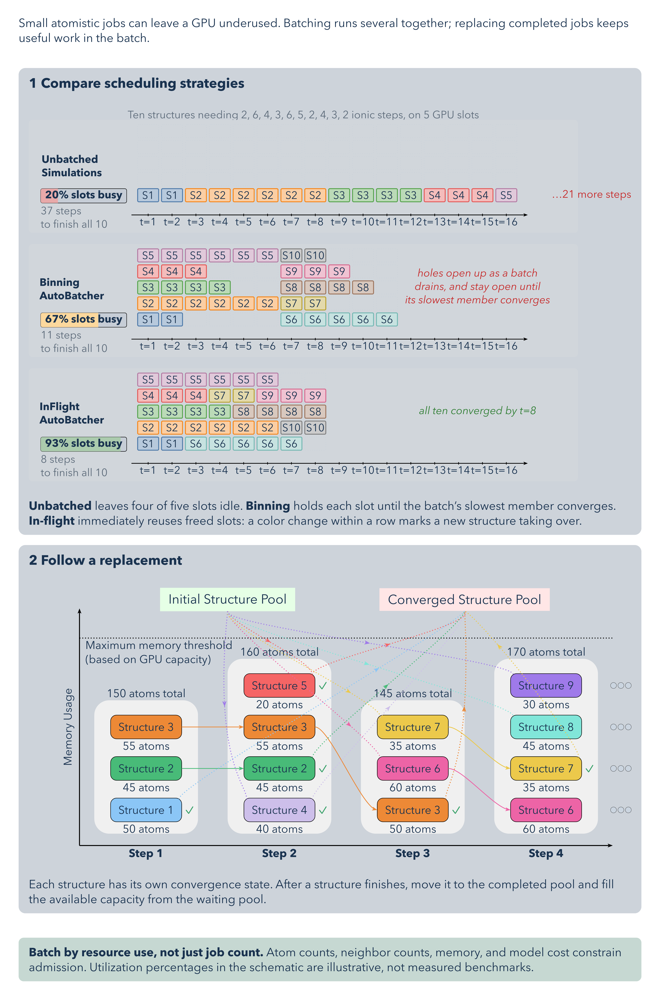 | 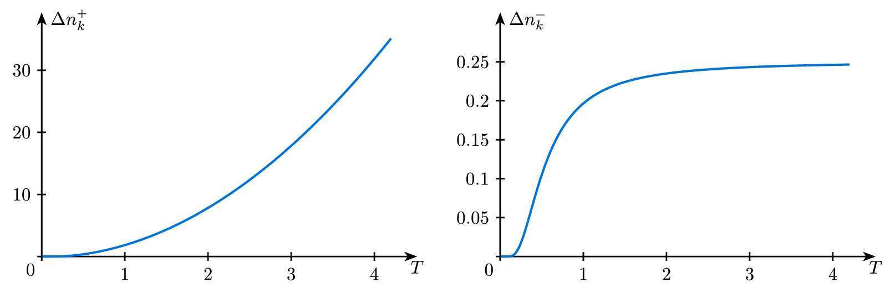 |
| [Graph Isomorphism](https://janosh.github.io/diagrams/graph-isomorphism) &nbsp;[![LaTeX][latex-logo]](assets/graph-isomorphism/graph-isomorphism.tex)&nbsp;[![Typst][typst-logo]](assets/graph-isomorphism/graph-isomorphism.typ) | [Graph Neural Networks](https://janosh.github.io/diagrams/graph-neural-networks) &nbsp;[![Typst][typst-logo]](assets/graph-neural-networks/graph-neural-networks.typ) |
| 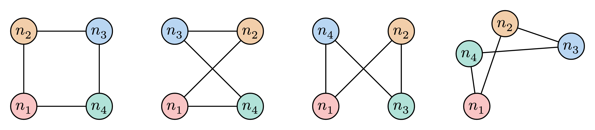 | 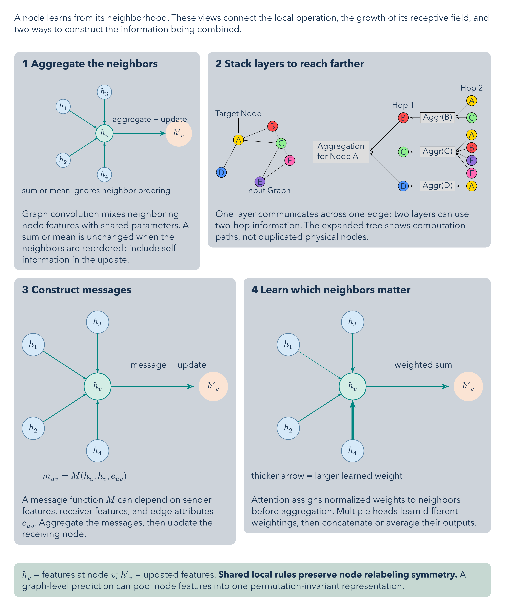 |
| [Gravitons](https://janosh.github.io/diagrams/gravitons) &nbsp;[![LaTeX][latex-logo]](assets/gravitons/gravitons.tex)&nbsp;[![Typst][typst-logo]](assets/gravitons/gravitons.typ) | [Gun Tackle](https://janosh.github.io/diagrams/gun-tackle) &nbsp;[![Typst][typst-logo]](assets/gun-tackle/gun-tackle.typ) |
|  | 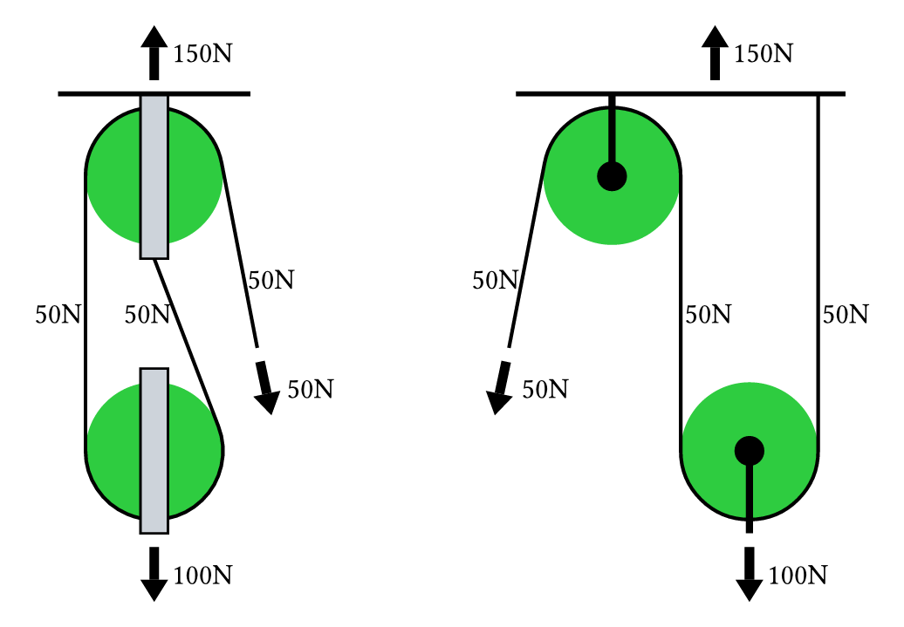 |
| [H2 Bond Breaking](https://janosh.github.io/diagrams/h2-bond-breaking) &nbsp;[![Typst][typst-logo]](assets/h2-bond-breaking/h2-bond-breaking.typ) | [Hamiltonian Graph](https://janosh.github.io/diagrams/hamiltonian-graph) &nbsp;[![LaTeX][latex-logo]](assets/hamiltonian-graph/hamiltonian-graph.tex)&nbsp;[![Typst][typst-logo]](assets/hamiltonian-graph/hamiltonian-graph.typ) |
| 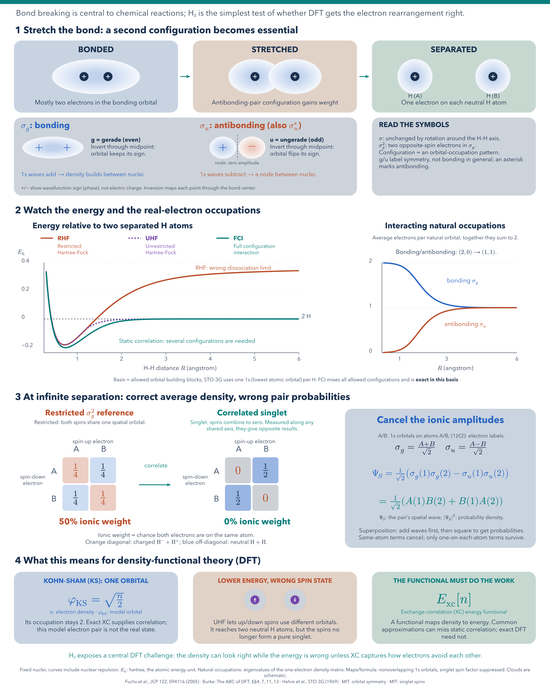 | 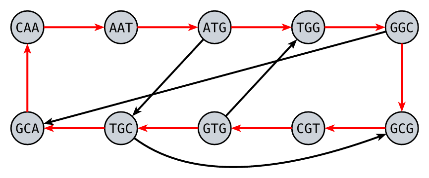 |
| [High Entropy Alloy](https://janosh.github.io/diagrams/high-entropy-alloy) &nbsp;[![LaTeX][latex-logo]](assets/high-entropy-alloy/high-entropy-alloy.tex)&nbsp;[![Typst][typst-logo]](assets/high-entropy-alloy/high-entropy-alloy.typ) | [How Atoms Become Energy Bands](https://janosh.github.io/diagrams/how-atoms-become-energy-bands) &nbsp;[![Typst][typst-logo]](assets/how-atoms-become-energy-bands/how-atoms-become-energy-bands.typ) |
| 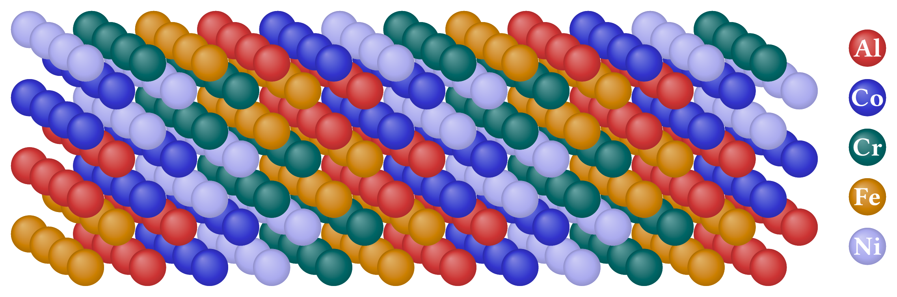 | 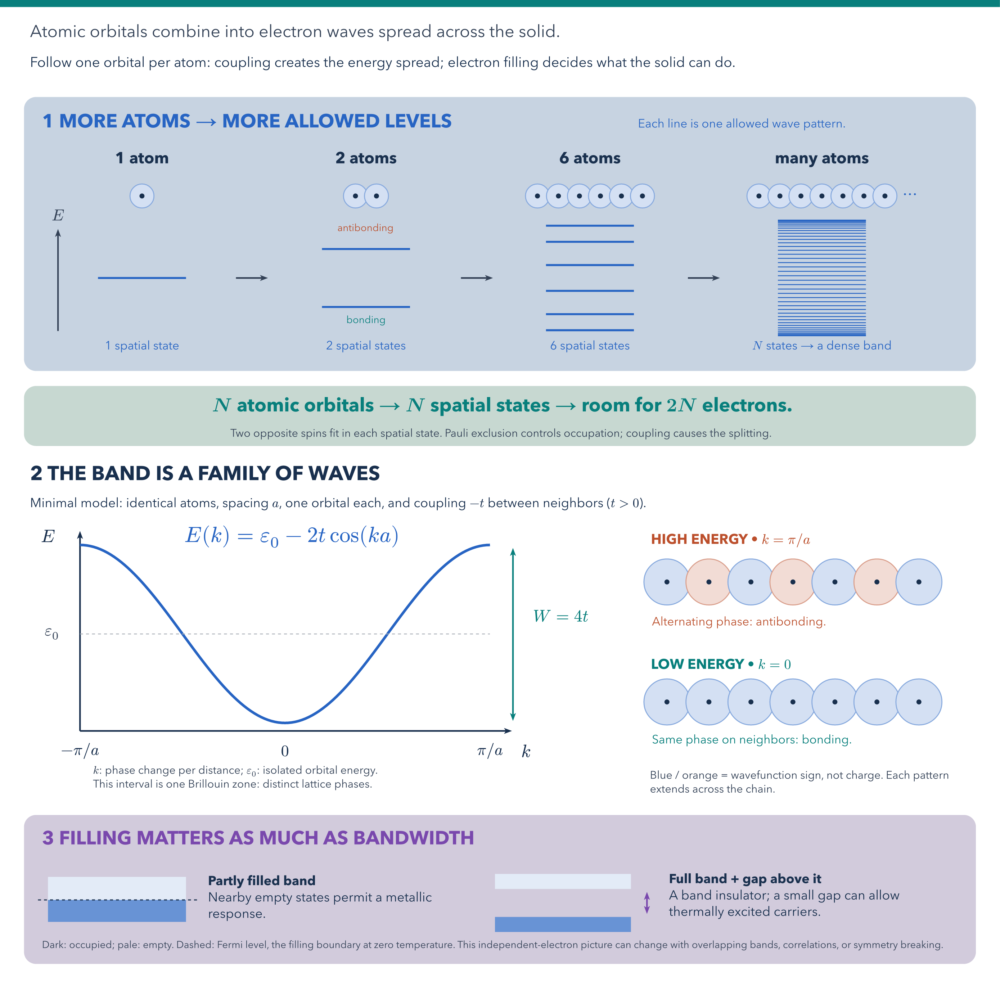 |
| [Isotherms](https://janosh.github.io/diagrams/isotherms) &nbsp;[![LaTeX][latex-logo]](assets/isotherms/isotherms.tex)&nbsp;[![Typst][typst-logo]](assets/isotherms/isotherms.typ) | [k-Nearest Neighbors](https://janosh.github.io/diagrams/k-nearest-neighbors) &nbsp;[![Typst][typst-logo]](assets/k-nearest-neighbors/k-nearest-neighbors.typ) |
| 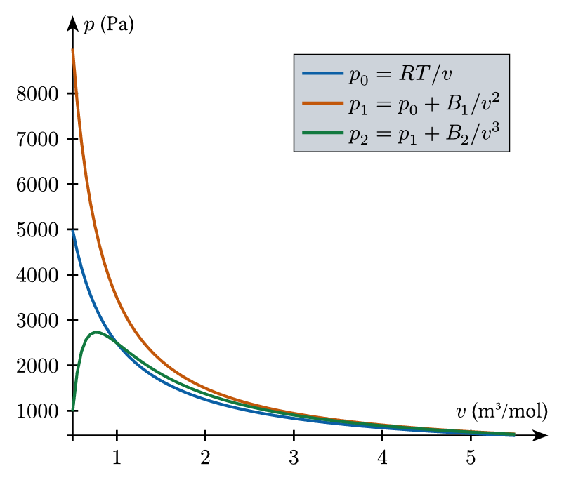 | 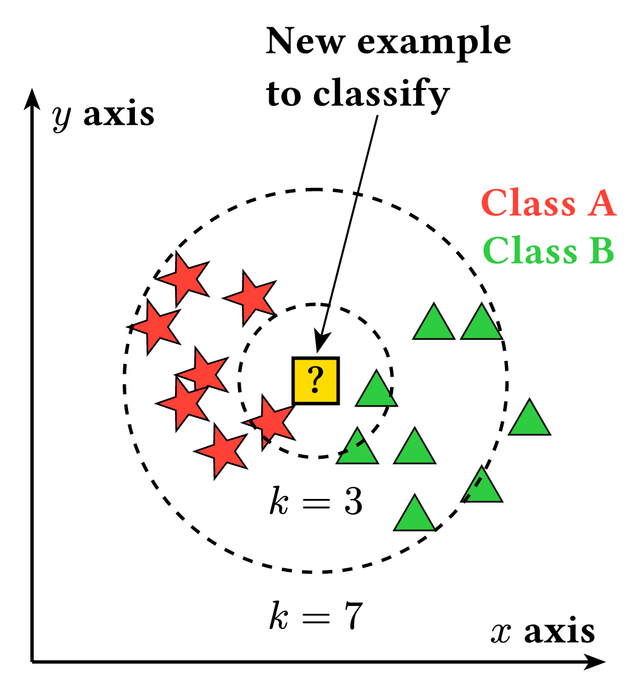 |
| [k-Space](https://janosh.github.io/diagrams/k-space) &nbsp;[![LaTeX][latex-logo]](assets/k-space/k-space.tex)&nbsp;[![Typst][typst-logo]](assets/k-space/k-space.typ) | [Kohn Sham Cycle](https://janosh.github.io/diagrams/kohn-sham-cycle) &nbsp;[![LaTeX][latex-logo]](assets/kohn-sham-cycle/kohn-sham-cycle.tex)&nbsp;[![Typst][typst-logo]](assets/kohn-sham-cycle/kohn-sham-cycle.typ) |
| 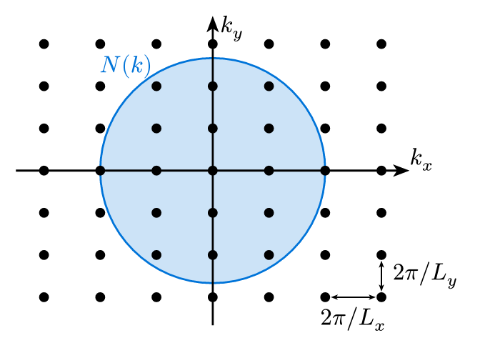 | 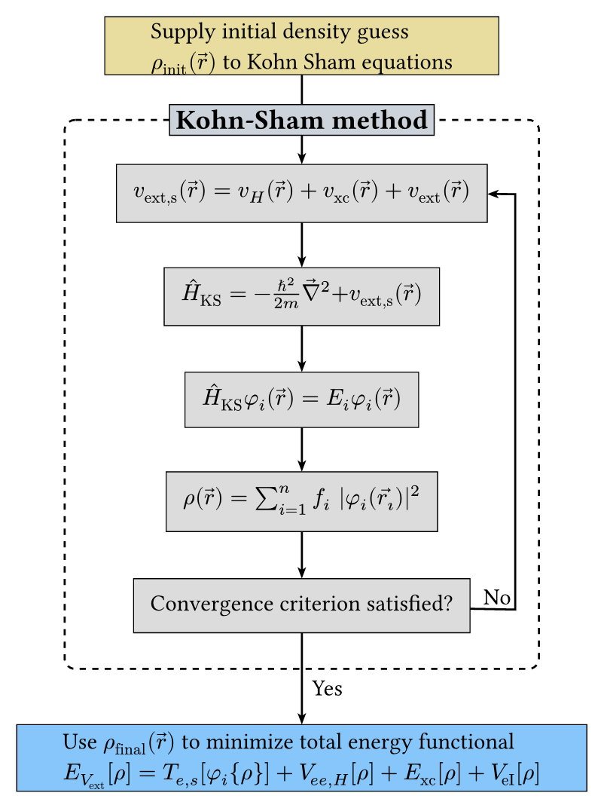 |
| [Light](https://janosh.github.io/diagrams/light) &nbsp;[![Typst][typst-logo]](assets/light/light.typ) | [Long Short-Term Memory](https://janosh.github.io/diagrams/long-short-term-memory) &nbsp;[![LaTeX][latex-logo]](assets/long-short-term-memory/long-short-term-memory.tex)&nbsp;[![Typst][typst-logo]](assets/long-short-term-memory/long-short-term-memory.typ) |
| 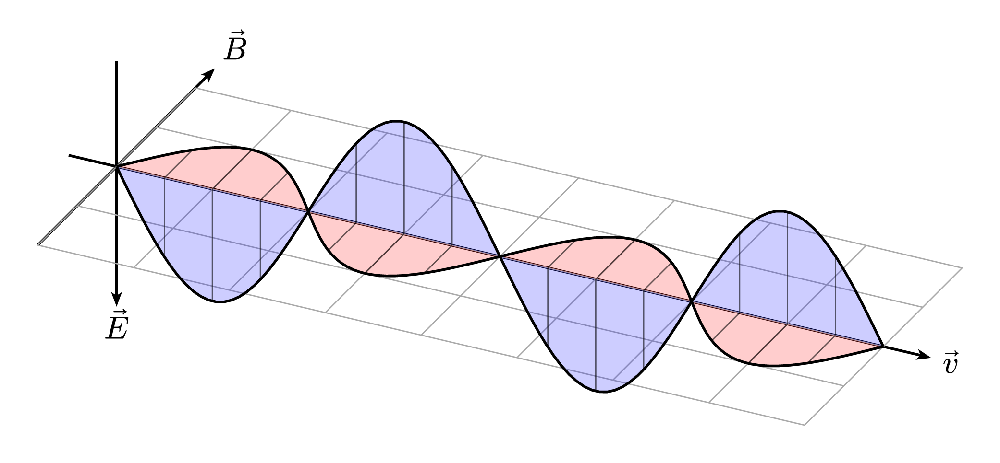 | 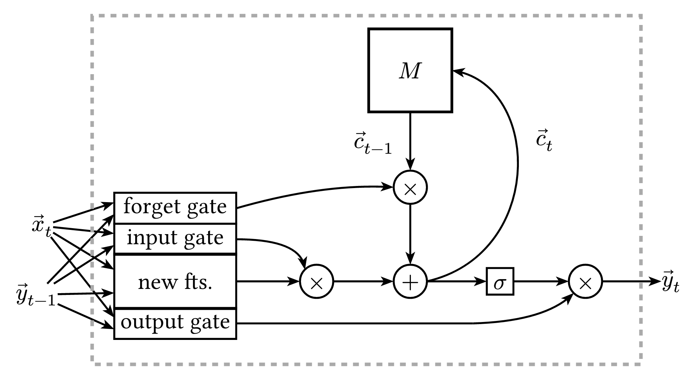 |
| [M-Theory](https://janosh.github.io/diagrams/m-theory) &nbsp;[![LaTeX][latex-logo]](assets/m-theory/m-theory.tex)&nbsp;[![Typst][typst-logo]](assets/m-theory/m-theory.typ) | [MADE](https://janosh.github.io/diagrams/made) &nbsp;[![LaTeX][latex-logo]](assets/made/made.tex)&nbsp;[![Typst][typst-logo]](assets/made/made.typ) |
| 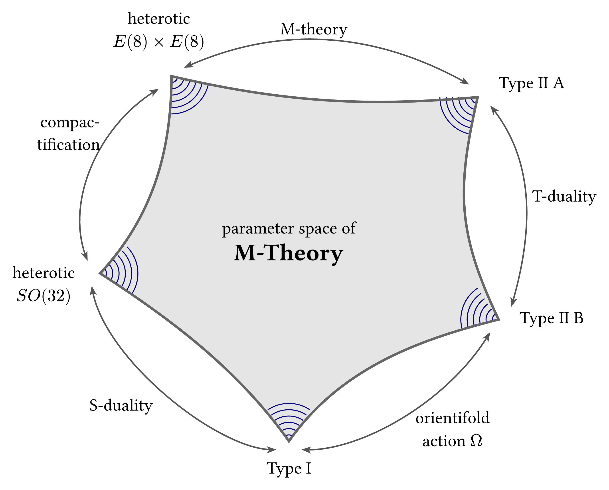 |  |
| [Magnetism Types](https://janosh.github.io/diagrams/magnetism-types) &nbsp;[![Typst][typst-logo]](assets/magnetism-types/magnetism-types.typ) | [Materials Informatics](https://janosh.github.io/diagrams/materials-informatics) &nbsp;[![LaTeX][latex-logo]](assets/materials-informatics/materials-informatics.tex)&nbsp;[![Typst][typst-logo]](assets/materials-informatics/materials-informatics.typ) |
| 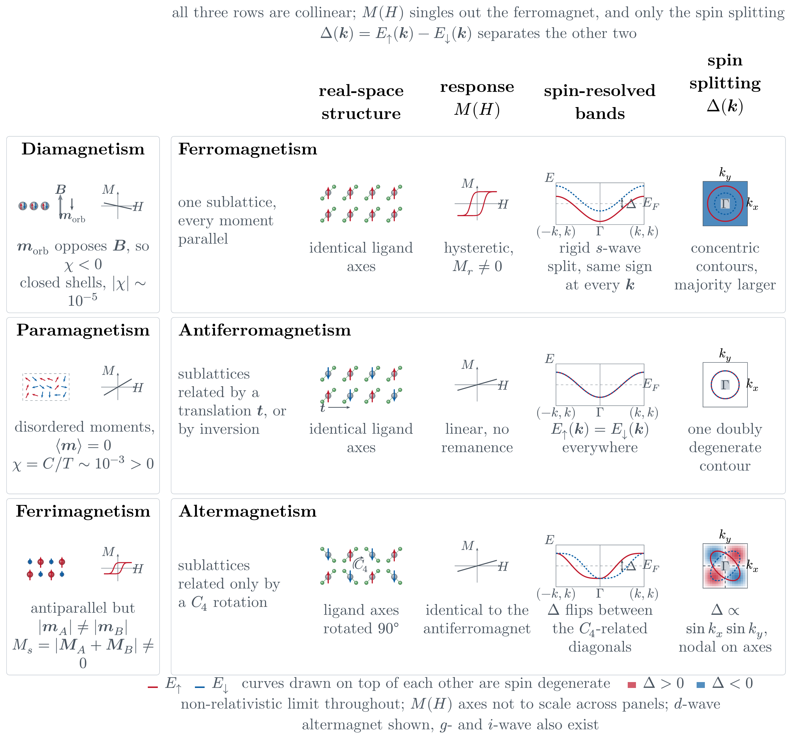 | 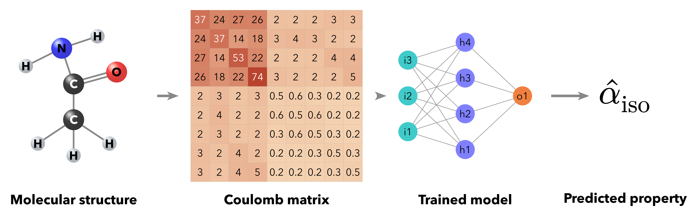 |
| [Materials Informatics Challenges](https://janosh.github.io/diagrams/materials-informatics-challenges) &nbsp;[![LaTeX][latex-logo]](assets/materials-informatics-challenges/materials-informatics-challenges.tex)&nbsp;[![Typst][typst-logo]](assets/materials-informatics-challenges/materials-informatics-challenges.typ) | [Matsubara Contours](https://janosh.github.io/diagrams/matsubara-contours) &nbsp;[![Typst][typst-logo]](assets/matsubara-contours/matsubara-contours.typ) |
| 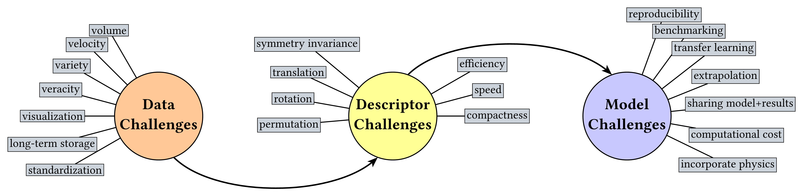 | 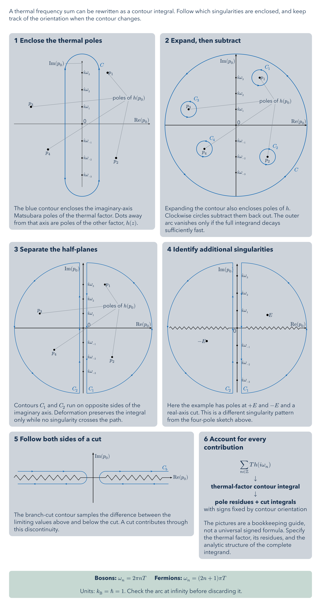 |
| [Maximum Flow Problem](https://janosh.github.io/diagrams/maximum-flow-problem) &nbsp;[![LaTeX][latex-logo]](assets/maximum-flow-problem/maximum-flow-problem.tex)&nbsp;[![Typst][typst-logo]](assets/maximum-flow-problem/maximum-flow-problem.typ) | [Maxwell Boltzmann Distribution](https://janosh.github.io/diagrams/maxwell-boltzmann-distribution) &nbsp;[![LaTeX][latex-logo]](assets/maxwell-boltzmann-distribution/maxwell-boltzmann-distribution.tex)&nbsp;[![Typst][typst-logo]](assets/maxwell-boltzmann-distribution/maxwell-boltzmann-distribution.typ) |
| 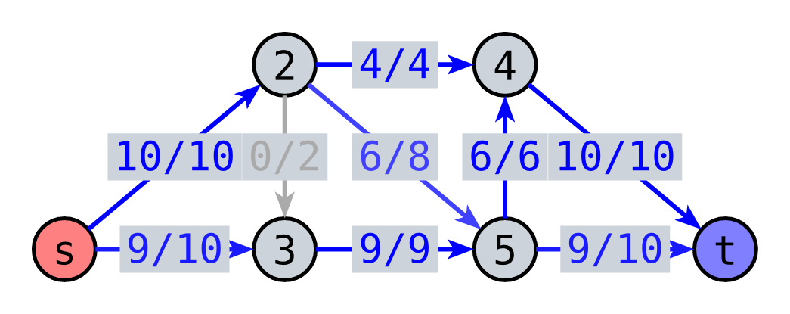 | 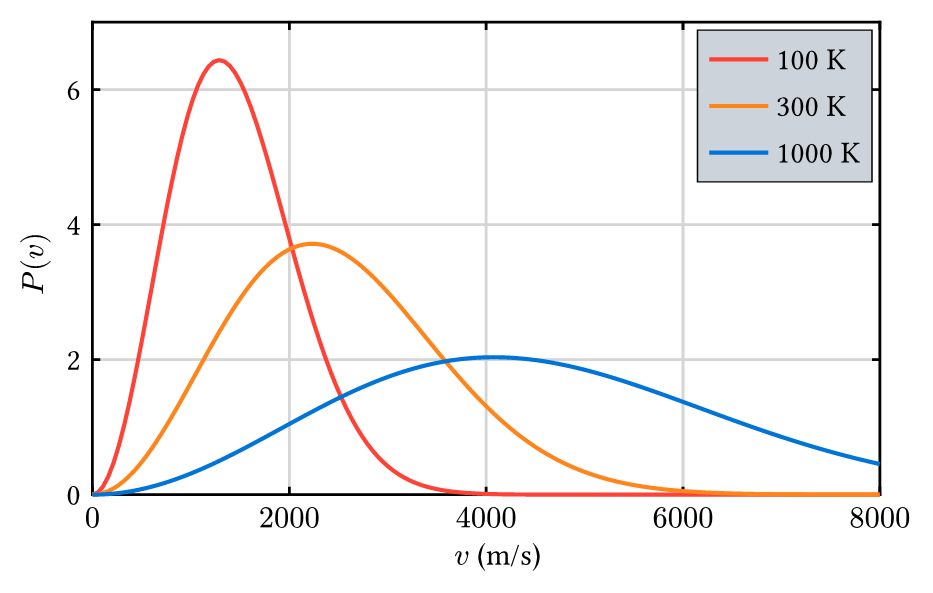 |
| [ML Activations](https://janosh.github.io/diagrams/ml-activations) &nbsp;[![Typst][typst-logo]](assets/ml-activations/ml-activations.typ) | [Momentum Shell](https://janosh.github.io/diagrams/momentum-shell) &nbsp;[![LaTeX][latex-logo]](assets/momentum-shell/momentum-shell.tex)&nbsp;[![Typst][typst-logo]](assets/momentum-shell/momentum-shell.typ) |
| 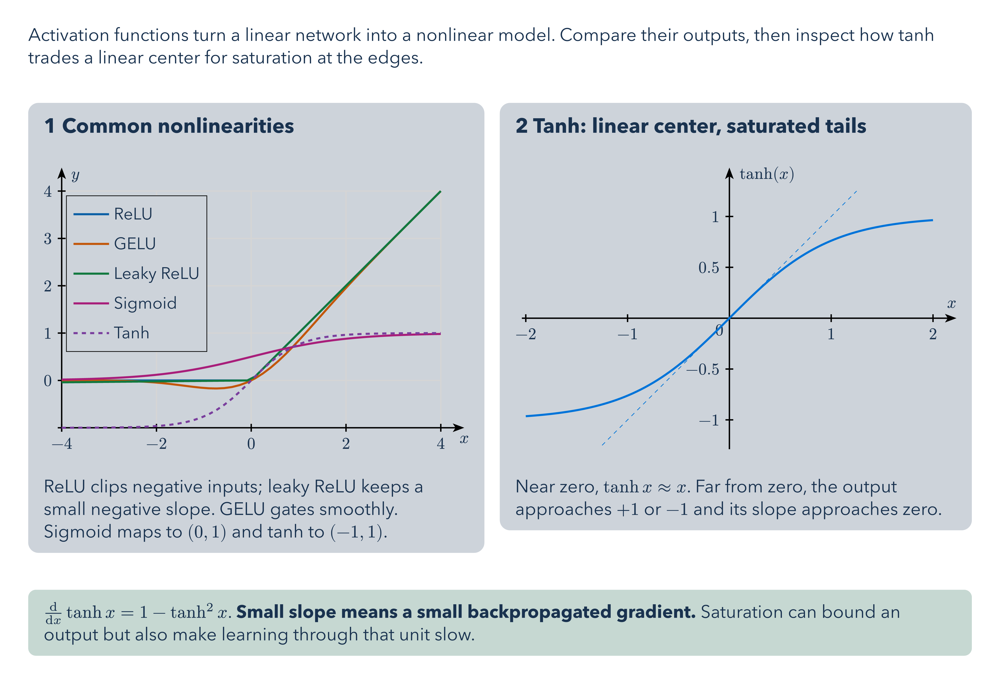 | 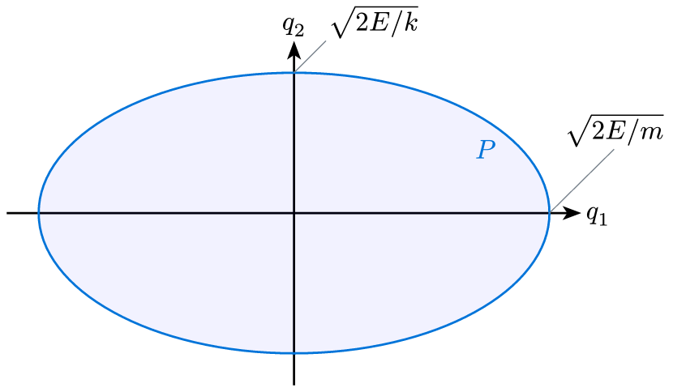 |
| [MOSFET](https://janosh.github.io/diagrams/mosfet) &nbsp;[![LaTeX][latex-logo]](assets/mosfet/mosfet.tex)&nbsp;[![Typst][typst-logo]](assets/mosfet/mosfet.typ) | [Multilayer Perceptron](https://janosh.github.io/diagrams/multilayer-perceptron) &nbsp;[![LaTeX][latex-logo]](assets/multilayer-perceptron/multilayer-perceptron.tex)&nbsp;[![Typst][typst-logo]](assets/multilayer-perceptron/multilayer-perceptron.typ) |
| 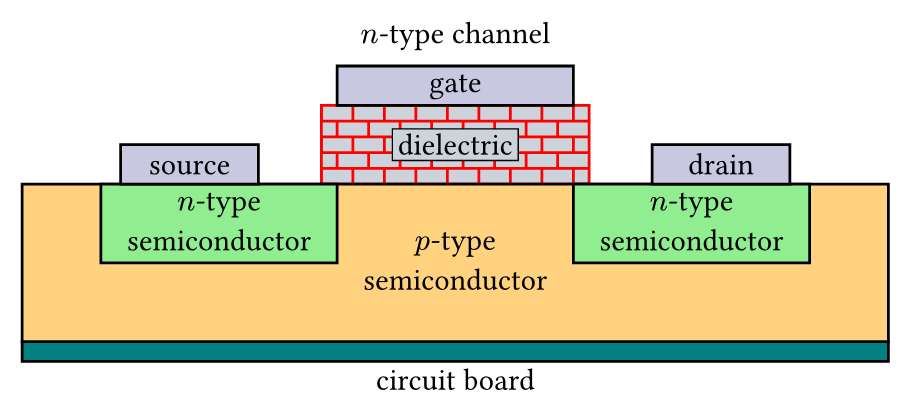 | 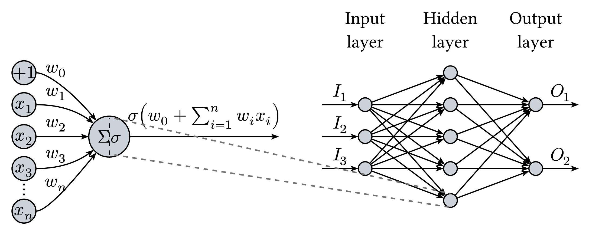 |
| [NMOSFET Amplifier Circuit](https://janosh.github.io/diagrams/nmosfet-amplifier-circuit) &nbsp;[![Typst][typst-logo]](assets/nmosfet-amplifier-circuit/nmosfet-amplifier-circuit.typ) | [Normalizing Flows](https://janosh.github.io/diagrams/normalizing-flows) &nbsp;[![Typst][typst-logo]](assets/normalizing-flows/normalizing-flows.typ) |
|  | 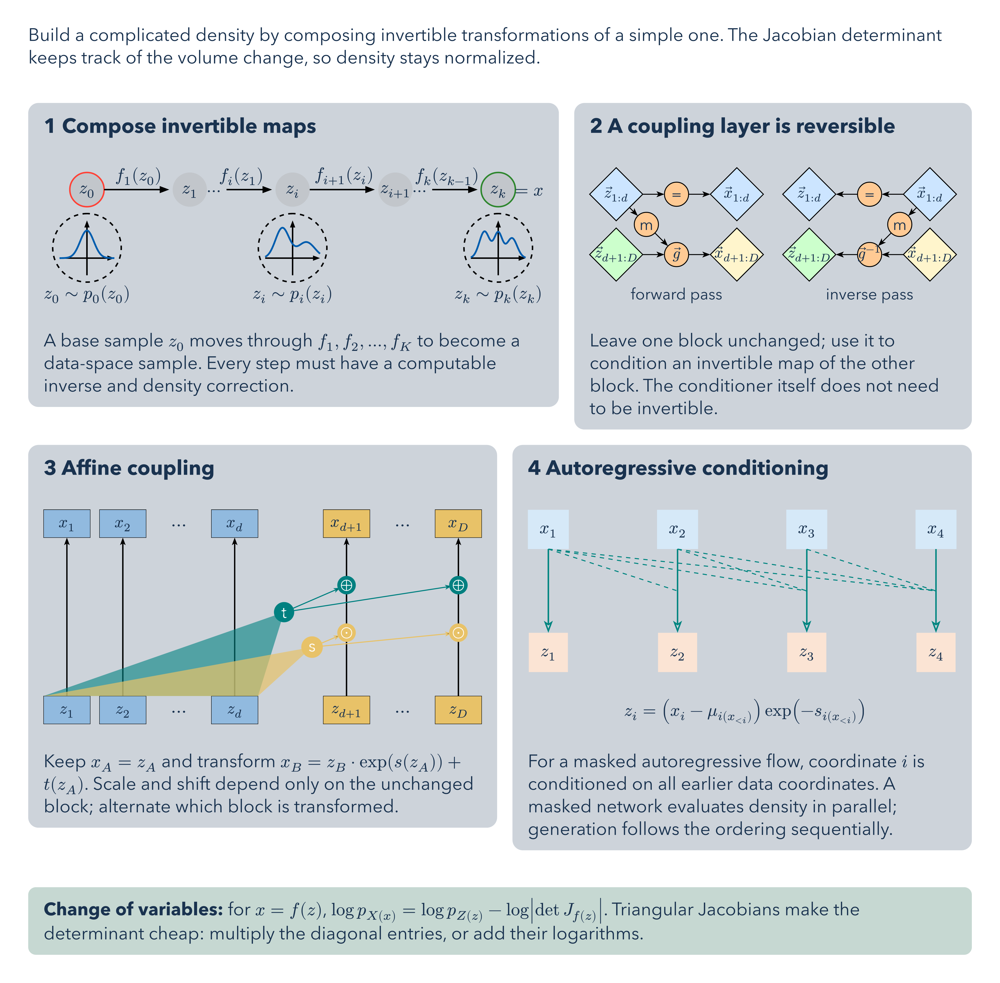 |
| [Operator Orderings](https://janosh.github.io/diagrams/operator-orderings) &nbsp;[![LaTeX][latex-logo]](assets/operator-orderings/operator-orderings.tex)&nbsp;[![Typst][typst-logo]](assets/operator-orderings/operator-orderings.typ) | [Organic Molecule](https://janosh.github.io/diagrams/organic-molecule) &nbsp;[![LaTeX][latex-logo]](assets/organic-molecule/organic-molecule.tex)&nbsp;[![Typst][typst-logo]](assets/organic-molecule/organic-molecule.typ) |
|  | 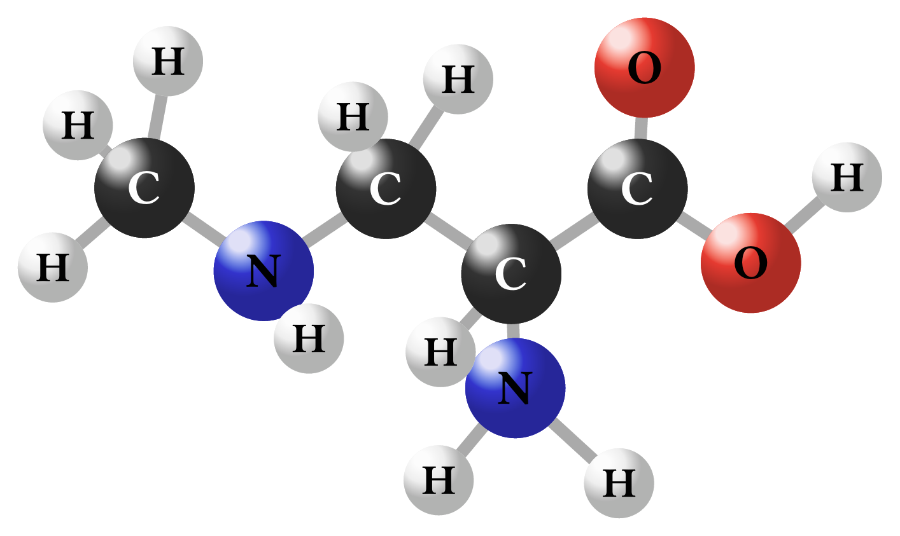 |
| [Otto Cycle](https://janosh.github.io/diagrams/otto-cycle) &nbsp;[![LaTeX][latex-logo]](assets/otto-cycle/otto-cycle.tex)&nbsp;[![Typst][typst-logo]](assets/otto-cycle/otto-cycle.typ) | [Particle Statistics](https://janosh.github.io/diagrams/particle-statistics) &nbsp;[![Typst][typst-logo]](assets/particle-statistics/particle-statistics.typ) |
| 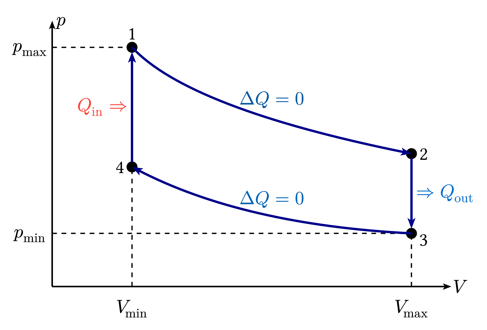 | 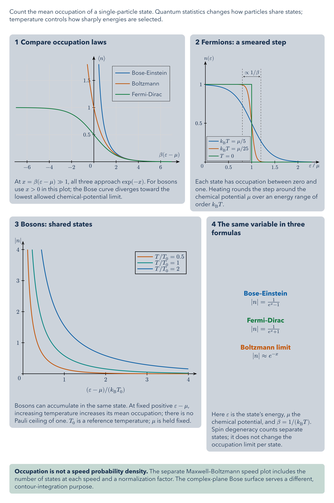 |
| [Periodic Table](https://janosh.github.io/diagrams/periodic-table) &nbsp;[![LaTeX][latex-logo]](assets/periodic-table/periodic-table.tex)&nbsp;[![Typst][typst-logo]](assets/periodic-table/periodic-table.typ) | [Plane to Torus](https://janosh.github.io/diagrams/plane-to-torus) &nbsp;[![LaTeX][latex-logo]](assets/plane-to-torus/plane-to-torus.tex)&nbsp;[![Typst][typst-logo]](assets/plane-to-torus/plane-to-torus.typ) |
| 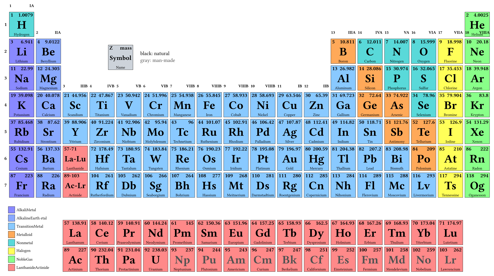 | 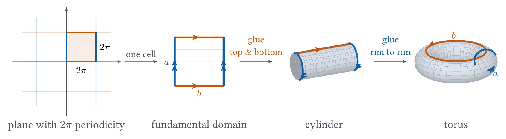 |
| [Plate Capacitor](https://janosh.github.io/diagrams/plate-capacitor) &nbsp;[![LaTeX][latex-logo]](assets/plate-capacitor/plate-capacitor.tex)&nbsp;[![Typst][typst-logo]](assets/plate-capacitor/plate-capacitor.typ) | [Propagator Fluctuations](https://janosh.github.io/diagrams/propagator-fluctuations) &nbsp;[![LaTeX][latex-logo]](assets/propagator-fluctuations/propagator-fluctuations.tex)&nbsp;[![Typst][typst-logo]](assets/propagator-fluctuations/propagator-fluctuations.typ) |
| 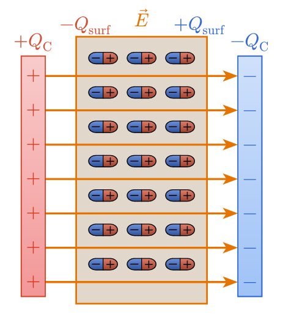 | 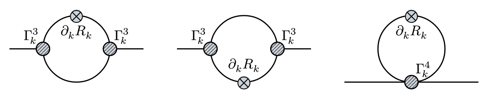 |
| [QFT Propagator Poles](https://janosh.github.io/diagrams/qft-propagator-poles) &nbsp;[![LaTeX][latex-logo]](assets/qft-propagator-poles/qft-propagator-poles.tex)&nbsp;[![Typst][typst-logo]](assets/qft-propagator-poles/qft-propagator-poles.typ) | [QFT Propagators](https://janosh.github.io/diagrams/qft-propagators) &nbsp;[![LaTeX][latex-logo]](assets/qft-propagators/qft-propagators.tex)&nbsp;[![Typst][typst-logo]](assets/qft-propagators/qft-propagators.typ) |
| 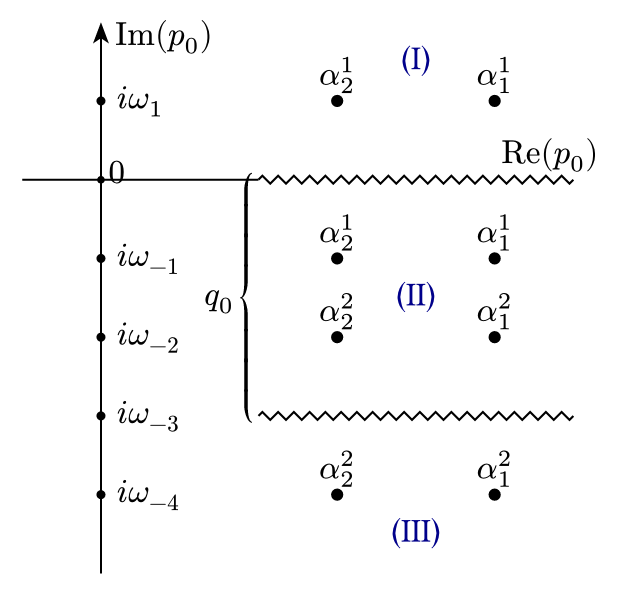 | 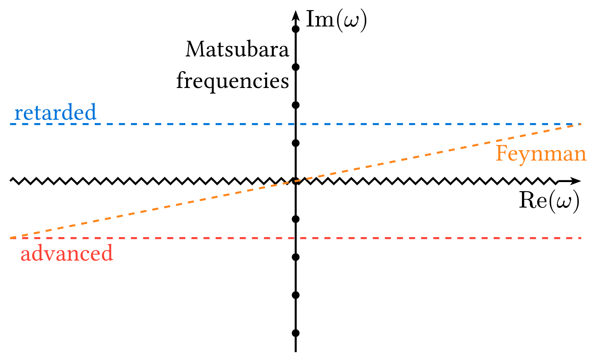 |
| [Cost vs Accuracy in Quantum Mechanical Simulations](https://janosh.github.io/diagrams/qm-cost-vs-acc) &nbsp;[![LaTeX][latex-logo]](assets/qm-cost-vs-acc/qm-cost-vs-acc.tex)&nbsp;[![Typst][typst-logo]](assets/qm-cost-vs-acc/qm-cost-vs-acc.typ) | [Quantum Harmonic Oscillator](https://janosh.github.io/diagrams/quantum-harmonic-oscillator) &nbsp;[![Typst][typst-logo]](assets/quantum-harmonic-oscillator/quantum-harmonic-oscillator.typ) |
| 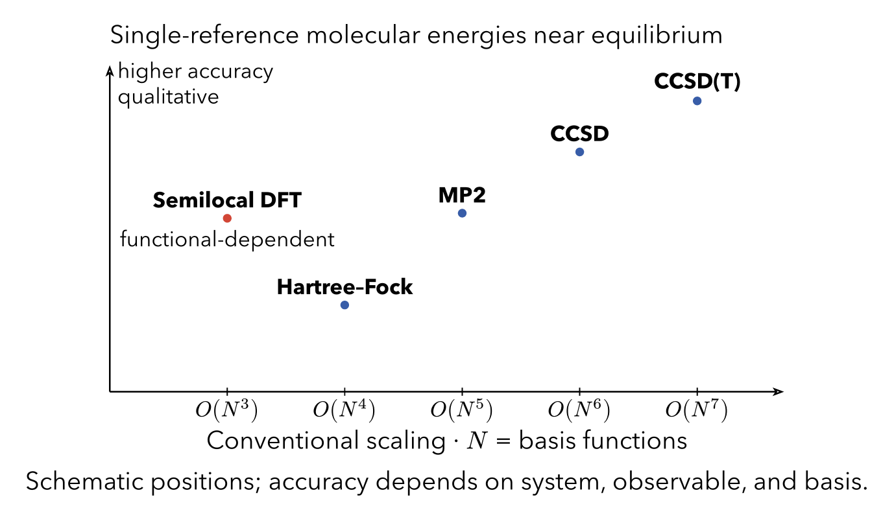 | 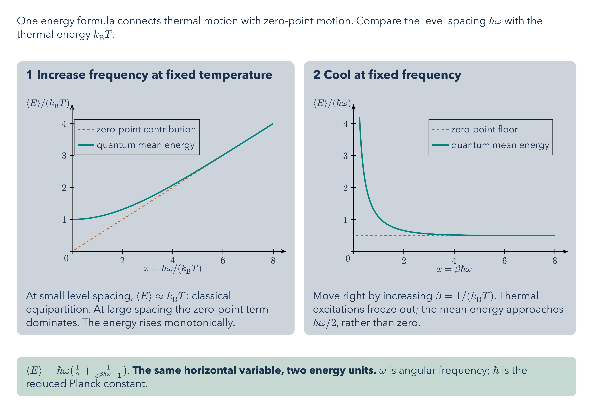 |
| [Random Forest](https://janosh.github.io/diagrams/random-forest) &nbsp;[![LaTeX][latex-logo]](assets/random-forest/random-forest.tex)&nbsp;[![Typst][typst-logo]](assets/random-forest/random-forest.typ) | [Regular vs Bayes NN](https://janosh.github.io/diagrams/regular-vs-bayes-nn) &nbsp;[![LaTeX][latex-logo]](assets/regular-vs-bayes-nn/regular-vs-bayes-nn.tex)&nbsp;[![Typst][typst-logo]](assets/regular-vs-bayes-nn/regular-vs-bayes-nn.typ) |
| 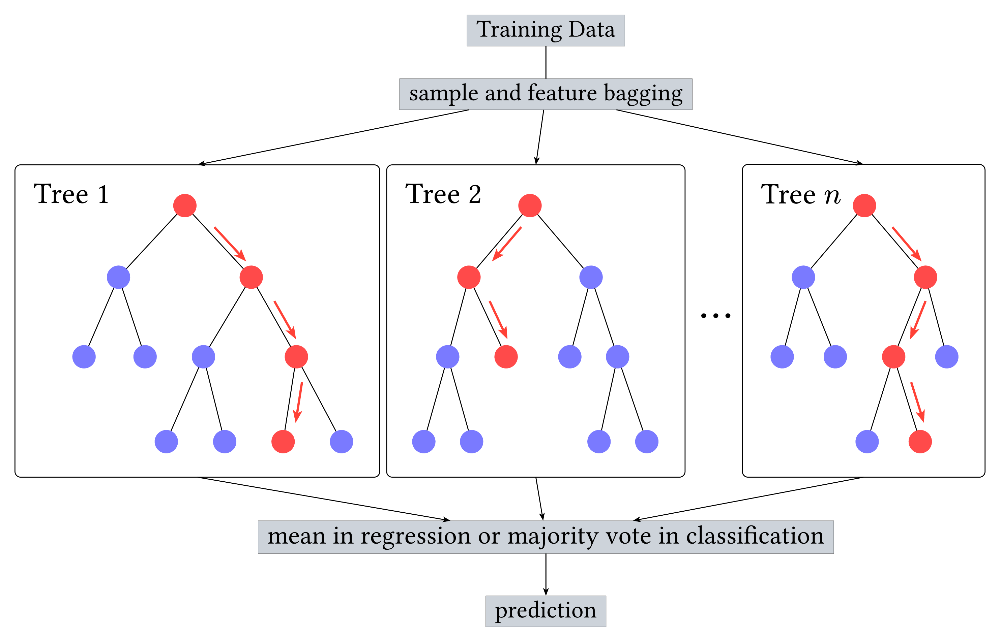 | 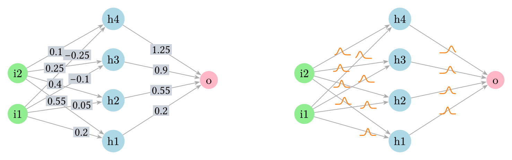 |
| [Regulated and Unregulated Propagators](https://janosh.github.io/diagrams/regulated-and-unregulated-propagators) &nbsp;[![Typst][typst-logo]](assets/regulated-and-unregulated-propagators/regulated-and-unregulated-propagators.typ) | [Reinforcement Learning Greedy Policy](https://janosh.github.io/diagrams/reinforcement-learning-greedy-policy) &nbsp;[![LaTeX][latex-logo]](assets/reinforcement-learning-greedy-policy/reinforcement-learning-greedy-policy.tex)&nbsp;[![Typst][typst-logo]](assets/reinforcement-learning-greedy-policy/reinforcement-learning-greedy-policy.typ) |
| 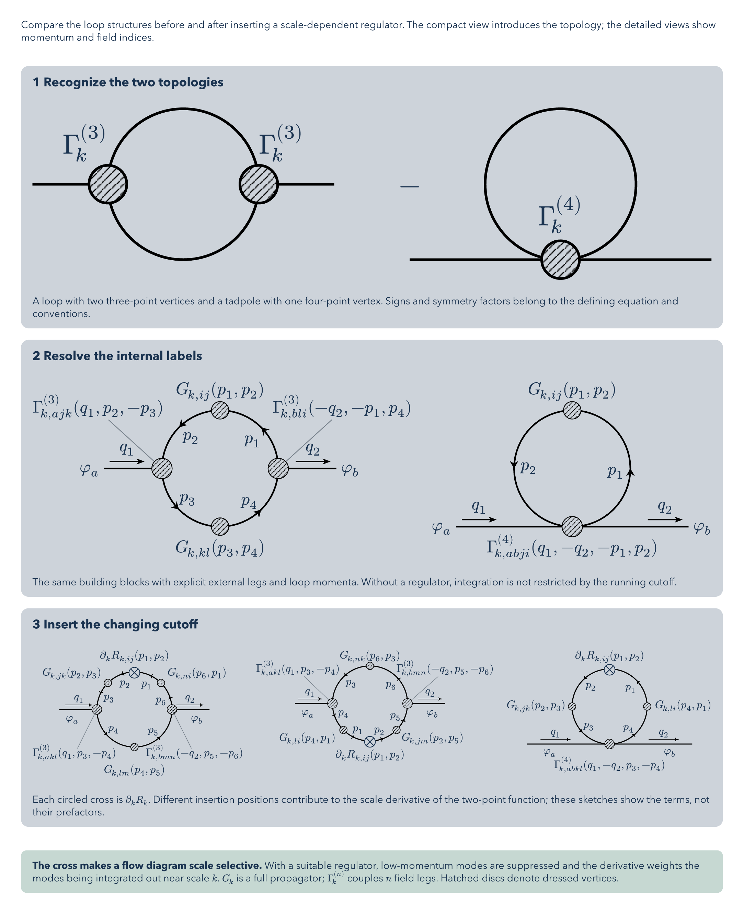 | 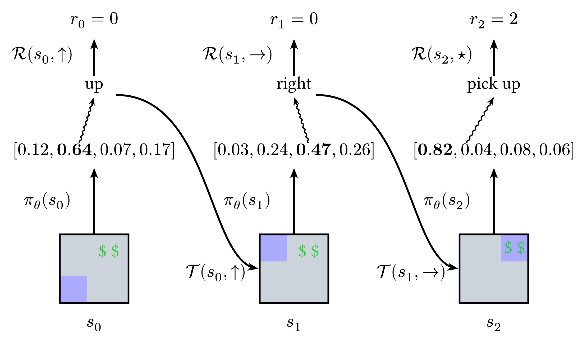 |
| [RG Flow in Theory Space](https://janosh.github.io/diagrams/rg-flow-in-theory-space) &nbsp;[![LaTeX][latex-logo]](assets/rg-flow-in-theory-space/rg-flow-in-theory-space.tex)&nbsp;[![Typst][typst-logo]](assets/rg-flow-in-theory-space/rg-flow-in-theory-space.typ) | [Risk-Opportunity Matrix](https://janosh.github.io/diagrams/risk-opportunity-matrix) &nbsp;[![Typst][typst-logo]](assets/risk-opportunity-matrix/risk-opportunity-matrix.typ) |
| 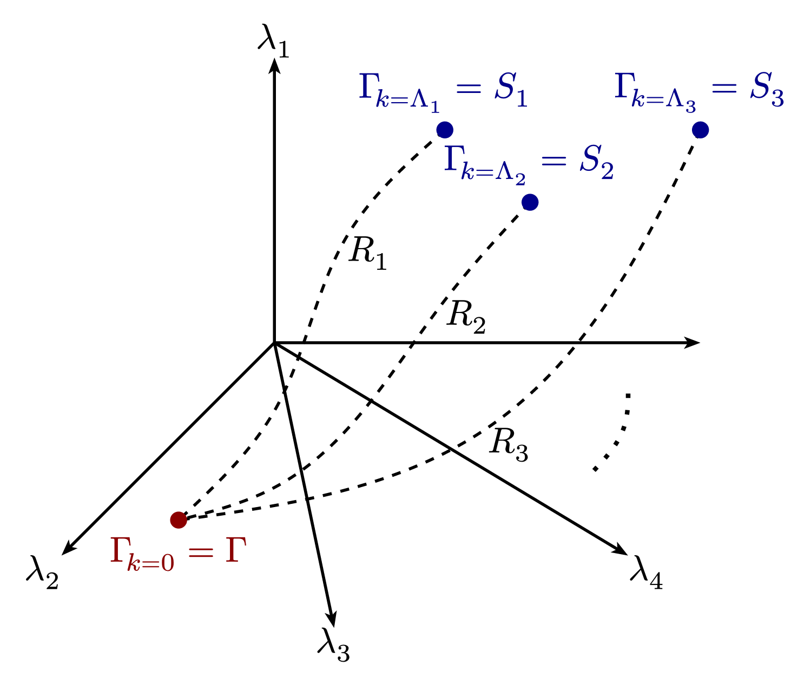 | 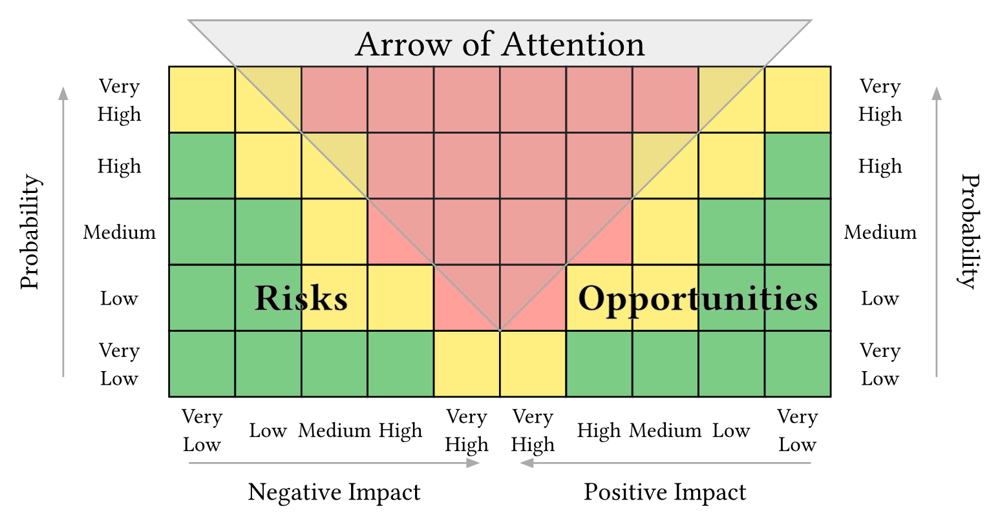 |
| [ROC Curve](https://janosh.github.io/diagrams/roc-curve) &nbsp;[![Typst][typst-logo]](assets/roc-curve/roc-curve.typ) | [Roost Update](https://janosh.github.io/diagrams/roost-update) &nbsp;[![LaTeX][latex-logo]](assets/roost-update/roost-update.tex)&nbsp;[![Typst][typst-logo]](assets/roost-update/roost-update.typ) |
| 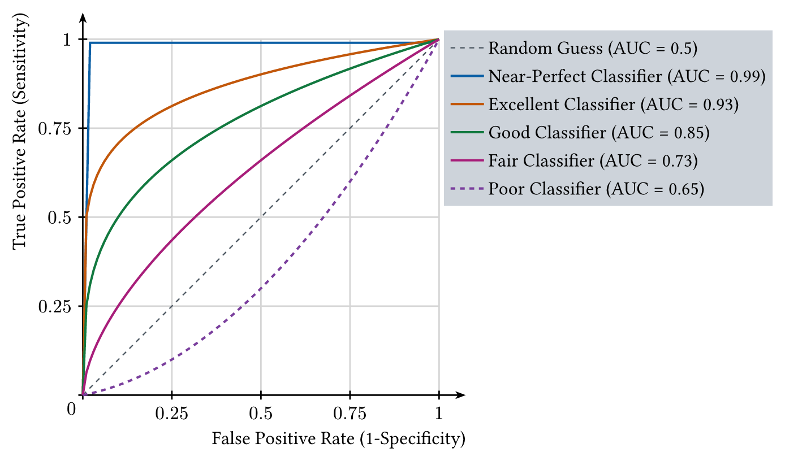 | 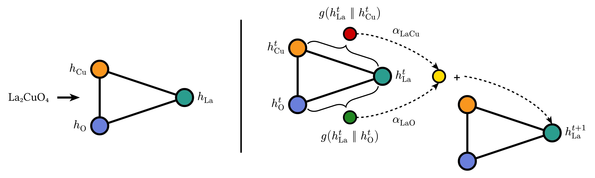 |
| [Sabatier Principle](https://janosh.github.io/diagrams/sabatier-principle) &nbsp;[![LaTeX][latex-logo]](assets/sabatier-principle/sabatier-principle.tex)&nbsp;[![Typst][typst-logo]](assets/sabatier-principle/sabatier-principle.typ) | [Saddle Point](https://janosh.github.io/diagrams/saddle-point) &nbsp;[![LaTeX][latex-logo]](assets/saddle-point/saddle-point.tex)&nbsp;[![Typst][typst-logo]](assets/saddle-point/saddle-point.typ) |
| 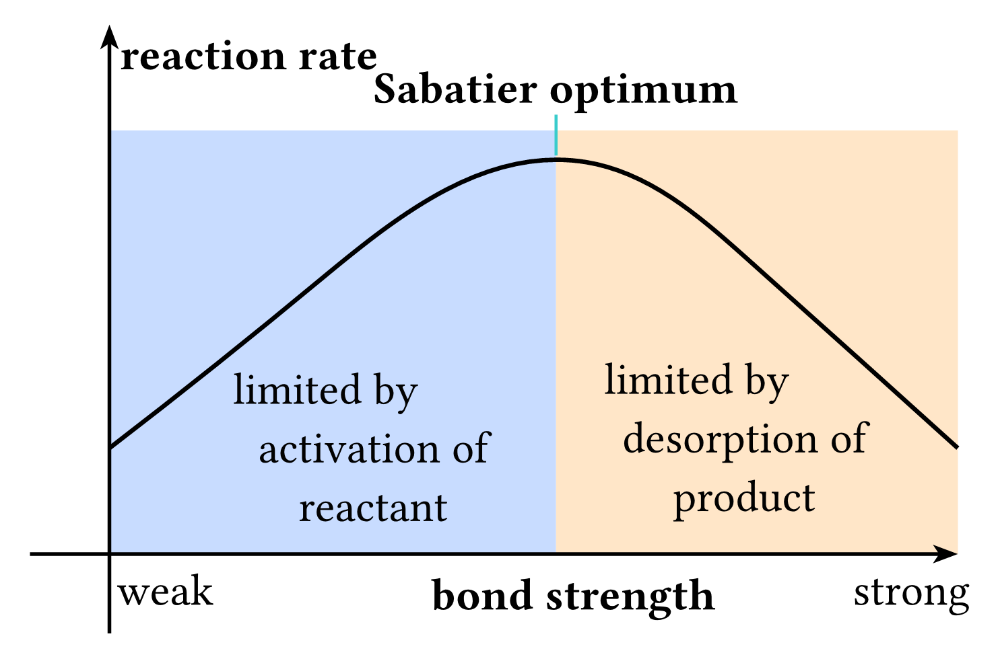 | 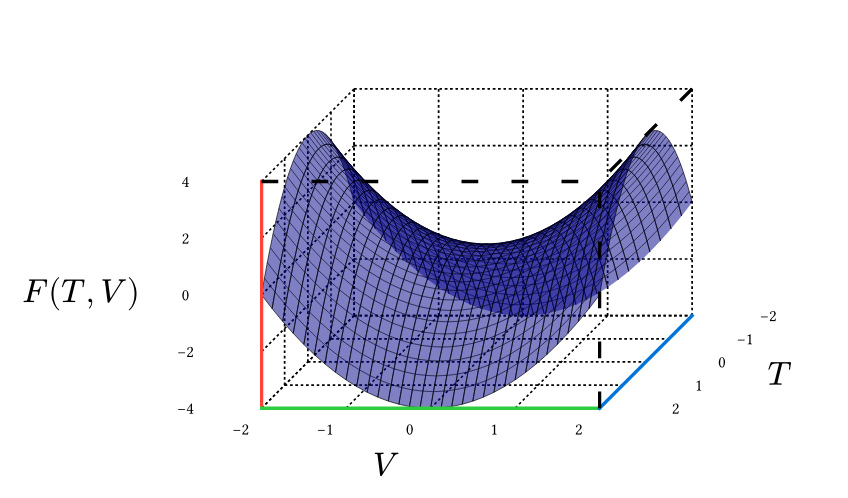 |
| [Scattering Detailed Balance](https://janosh.github.io/diagrams/scattering-detailed-balance) &nbsp;[![LaTeX][latex-logo]](assets/scattering-detailed-balance/scattering-detailed-balance.tex)&nbsp;[![Typst][typst-logo]](assets/scattering-detailed-balance/scattering-detailed-balance.typ) | [Seebeck Effect](https://janosh.github.io/diagrams/seebeck-effect) &nbsp;[![LaTeX][latex-logo]](assets/seebeck-effect/seebeck-effect.tex)&nbsp;[![Typst][typst-logo]](assets/seebeck-effect/seebeck-effect.typ) |
| 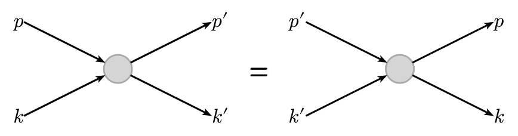 | 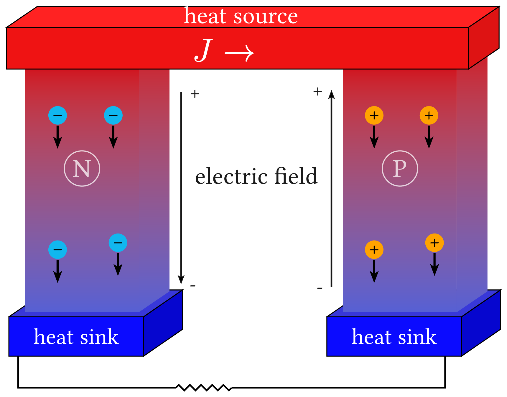 |
| [Self Attention](https://janosh.github.io/diagrams/self-attention) &nbsp;[![LaTeX][latex-logo]](assets/self-attention/self-attention.tex)&nbsp;[![Typst][typst-logo]](assets/self-attention/self-attention.typ) | [Semi-supervised Learning](https://janosh.github.io/diagrams/semi-supervised-learning) &nbsp;[![LaTeX][latex-logo]](assets/semi-supervised-learning/semi-supervised-learning.tex)&nbsp;[![Typst][typst-logo]](assets/semi-supervised-learning/semi-supervised-learning.typ) |
| 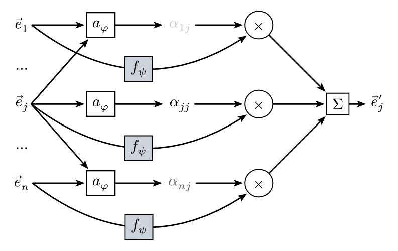 | 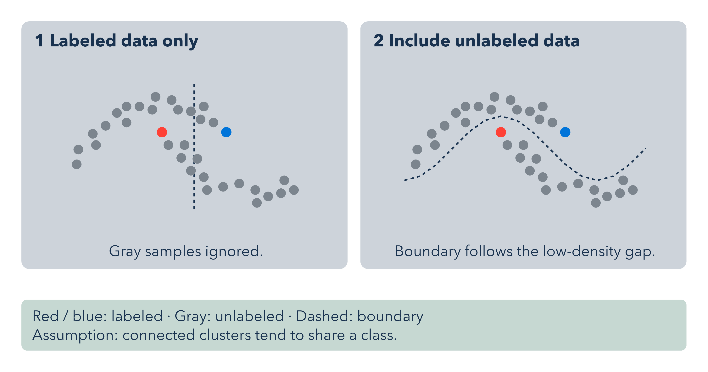 |
| [Shortest Path in Weighted Graph](https://janosh.github.io/diagrams/shortest-path-in-weighted-graph) &nbsp;[![LaTeX][latex-logo]](assets/shortest-path-in-weighted-graph/shortest-path-in-weighted-graph.tex)&nbsp;[![Typst][typst-logo]](assets/shortest-path-in-weighted-graph/shortest-path-in-weighted-graph.typ) | [Sierpinski Triangle](https://janosh.github.io/diagrams/sierpinski-triangle) &nbsp;[![Typst][typst-logo]](assets/sierpinski-triangle/sierpinski-triangle.typ) |
| 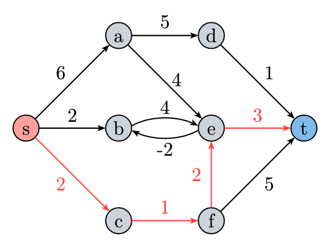 | 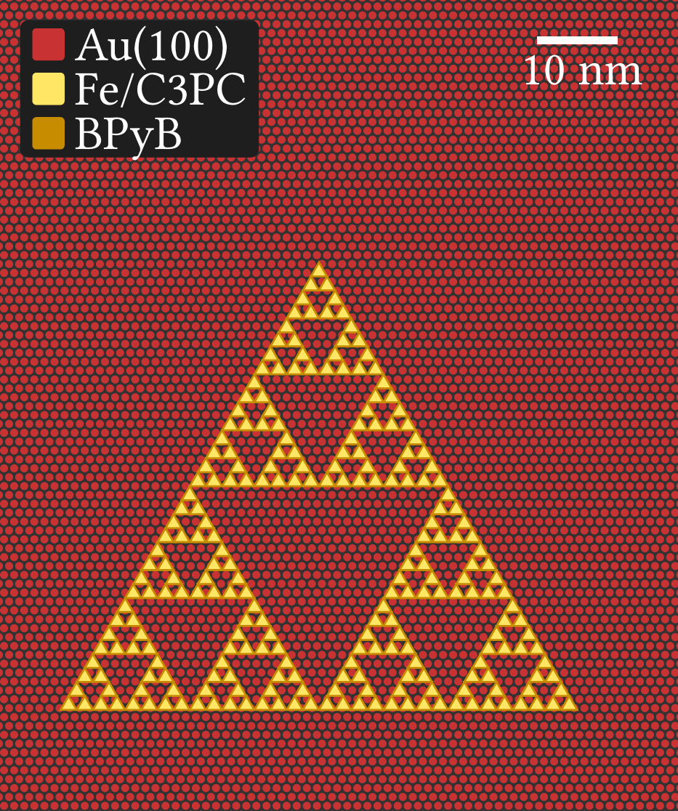 |
| [Signal Sampling](https://janosh.github.io/diagrams/signal-sampling) &nbsp;[![LaTeX][latex-logo]](assets/signal-sampling/signal-sampling.tex)&nbsp;[![Typst][typst-logo]](assets/signal-sampling/signal-sampling.typ) | [Single-head attention](https://janosh.github.io/diagrams/single-head-attention) &nbsp;[![LaTeX][latex-logo]](assets/single-head-attention/single-head-attention.tex)&nbsp;[![Typst][typst-logo]](assets/single-head-attention/single-head-attention.typ) |
| 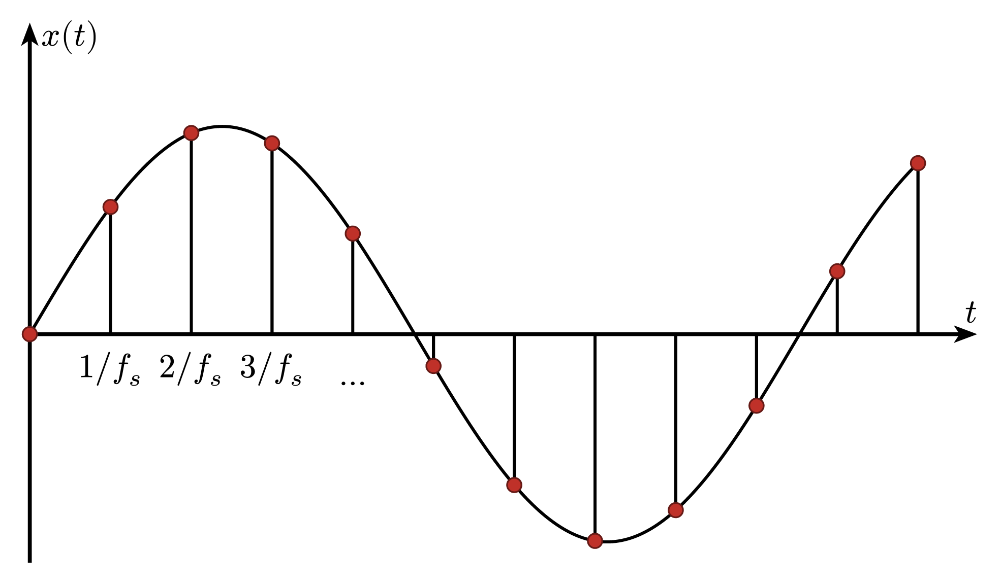 | 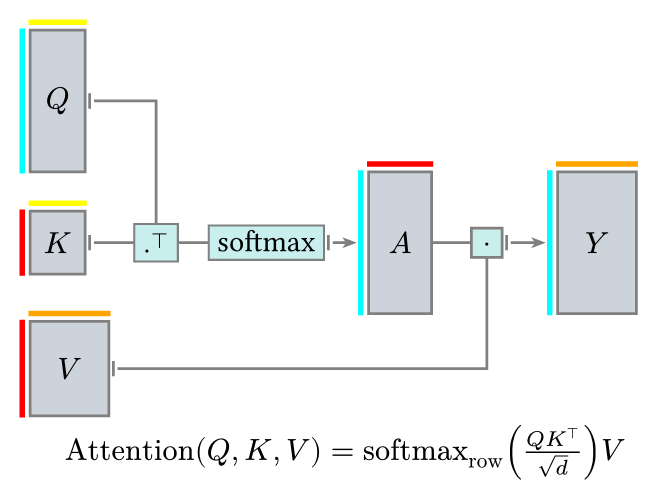 |
| [Skip Connection](https://janosh.github.io/diagrams/skip-connection) &nbsp;[![LaTeX][latex-logo]](assets/skip-connection/skip-connection.tex)&nbsp;[![Typst][typst-logo]](assets/skip-connection/skip-connection.typ) | [Spontaneous Magnetization](https://janosh.github.io/diagrams/spontaneous-magnetization) &nbsp;[![LaTeX][latex-logo]](assets/spontaneous-magnetization/spontaneous-magnetization.tex)&nbsp;[![Typst][typst-logo]](assets/spontaneous-magnetization/spontaneous-magnetization.typ) |
| 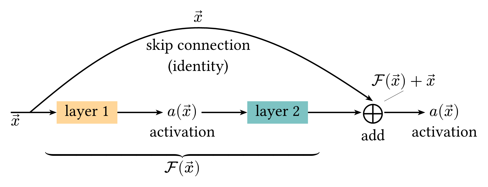 | 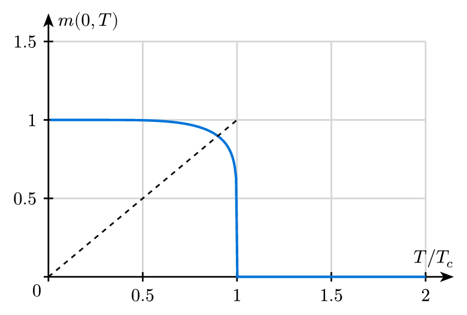 |
| [String Worldsheet Topologies](https://janosh.github.io/diagrams/string-worldsheet-topologies) &nbsp;[![Typst][typst-logo]](assets/string-worldsheet-topologies/string-worldsheet-topologies.typ) | [Sublattice Points](https://janosh.github.io/diagrams/sublattice-points) &nbsp;[![Typst][typst-logo]](assets/sublattice-points/sublattice-points.typ) |
| 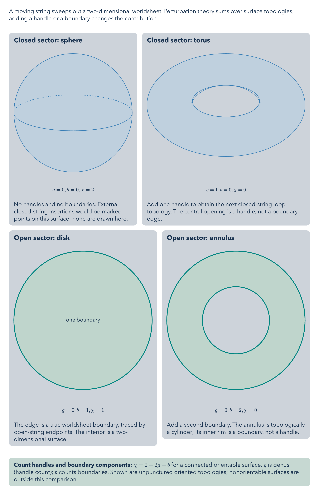 | 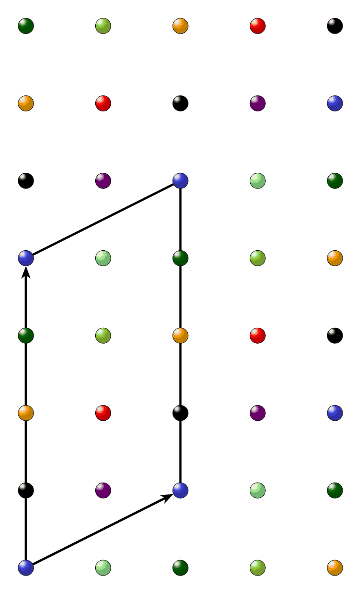 |
| [Supervised Learning Setup](https://janosh.github.io/diagrams/supervised-learning-setup) &nbsp;[![LaTeX][latex-logo]](assets/supervised-learning-setup/supervised-learning-setup.tex)&nbsp;[![Typst][typst-logo]](assets/supervised-learning-setup/supervised-learning-setup.typ) | [Symmetry Breaking](https://janosh.github.io/diagrams/symmetry-breaking) &nbsp;[![Typst][typst-logo]](assets/symmetry-breaking/symmetry-breaking.typ) |
| 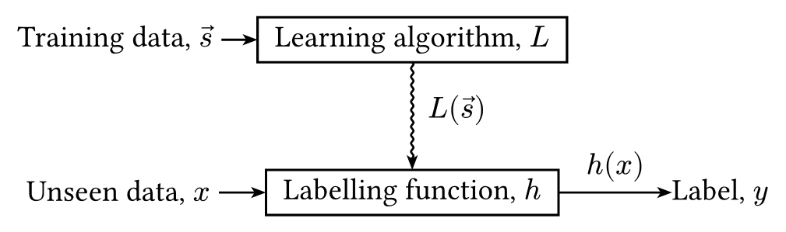 | 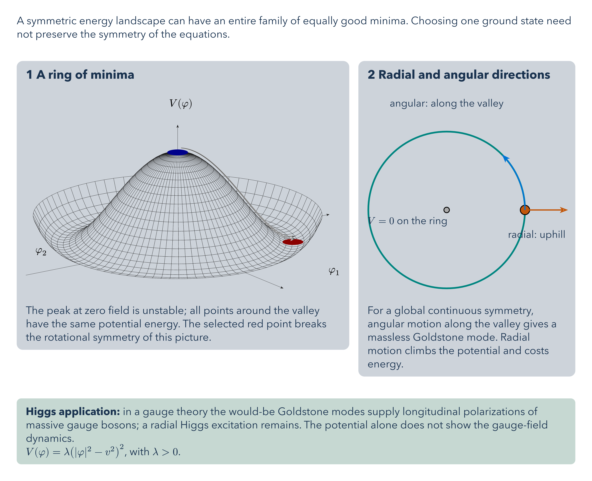 |
| [Thermodynamic Ensemble transforms](https://janosh.github.io/diagrams/thermo-ensemble-trafos) &nbsp;[![LaTeX][latex-logo]](assets/thermo-ensemble-trafos/thermo-ensemble-trafos.tex)&nbsp;[![Typst][typst-logo]](assets/thermo-ensemble-trafos/thermo-ensemble-trafos.typ) | [Thermodynamic Potentials Venn Diagram](https://janosh.github.io/diagrams/thermodynamic-potentials-venn-diagram) &nbsp;[![Typst][typst-logo]](assets/thermodynamic-potentials-venn-diagram/thermodynamic-potentials-venn-diagram.typ) |
|  | 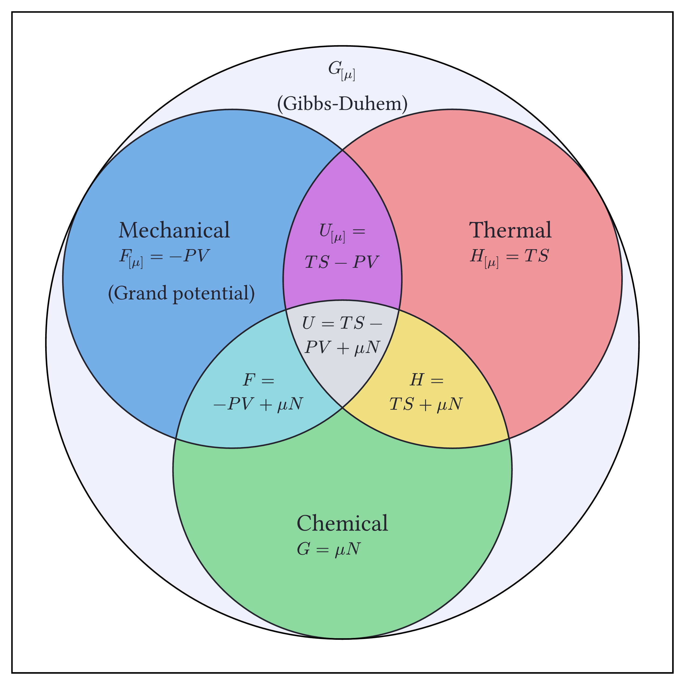 |
| [θ-β-M Diagram](https://janosh.github.io/diagrams/theta-beta-m-diagram) &nbsp;[![Typst][typst-logo]](assets/theta-beta-m-diagram/theta-beta-m-diagram.typ) | [Thomson Scattering](https://janosh.github.io/diagrams/thomson-scattering) &nbsp;[![LaTeX][latex-logo]](assets/thomson-scattering/thomson-scattering.tex) |
| 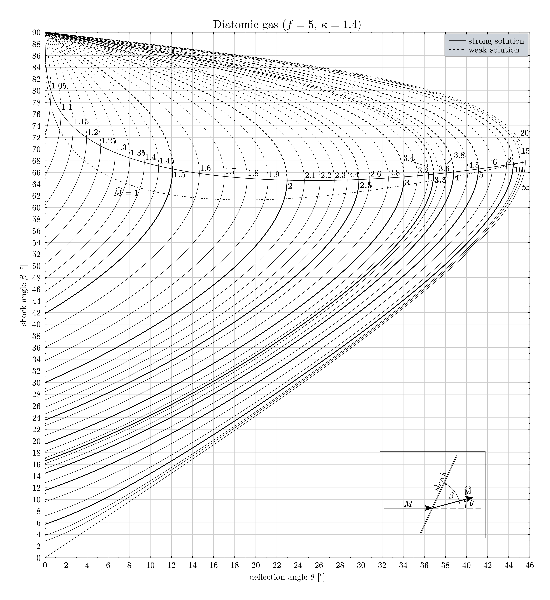 | 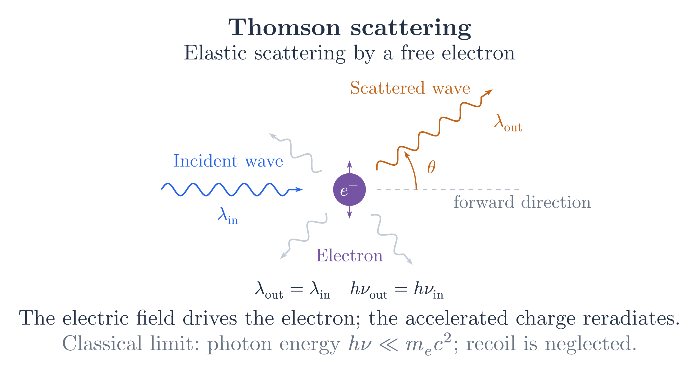 |
| [Timed Event Graph](https://janosh.github.io/diagrams/timed-event-graph) &nbsp;[![Typst][typst-logo]](assets/timed-event-graph/timed-event-graph.typ) | [Tori](https://janosh.github.io/diagrams/tori) &nbsp;[![LaTeX][latex-logo]](assets/tori/tori.tex) |
|  | 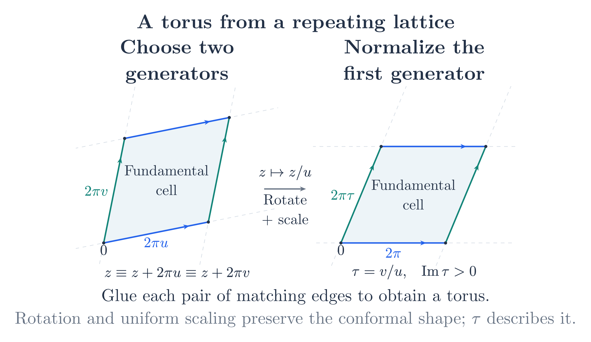 |
| [Torus](https://janosh.github.io/diagrams/torus) &nbsp;[![LaTeX][latex-logo]](assets/torus/torus.tex)&nbsp;[![Typst][typst-logo]](assets/torus/torus.typ) | [Torus Fundamental Domain](https://janosh.github.io/diagrams/torus-fundamental-domain) &nbsp;[![LaTeX][latex-logo]](assets/torus-fundamental-domain/torus-fundamental-domain.tex)&nbsp;[![Typst][typst-logo]](assets/torus-fundamental-domain/torus-fundamental-domain.typ) |
| 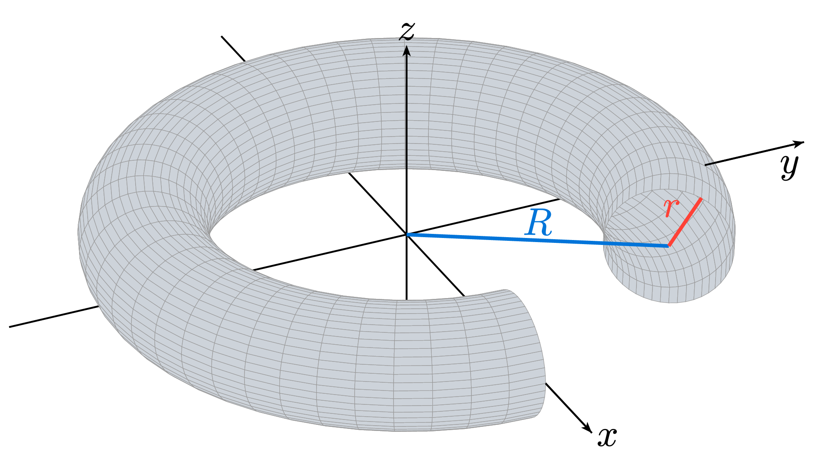 | 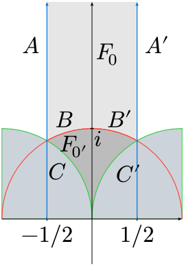 |
| [Train-Test Split](https://janosh.github.io/diagrams/train-test-split) &nbsp;[![Typst][typst-logo]](assets/train-test-split/train-test-split.typ) | [Web Graph](https://janosh.github.io/diagrams/web-graph) &nbsp;[![LaTeX][latex-logo]](assets/web-graph/web-graph.tex)&nbsp;[![Typst][typst-logo]](assets/web-graph/web-graph.typ) |
| 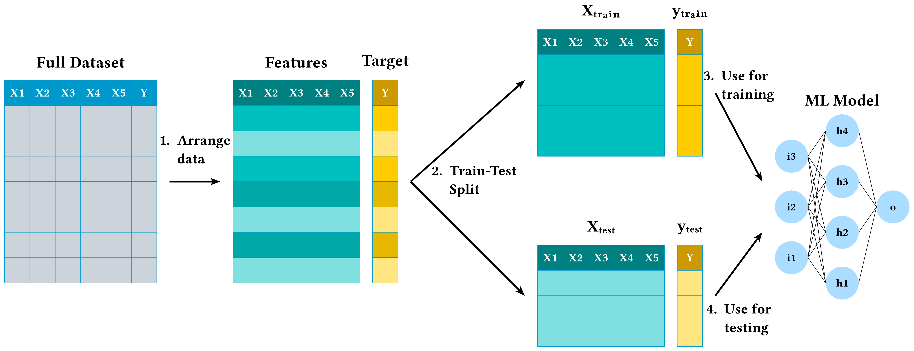 | 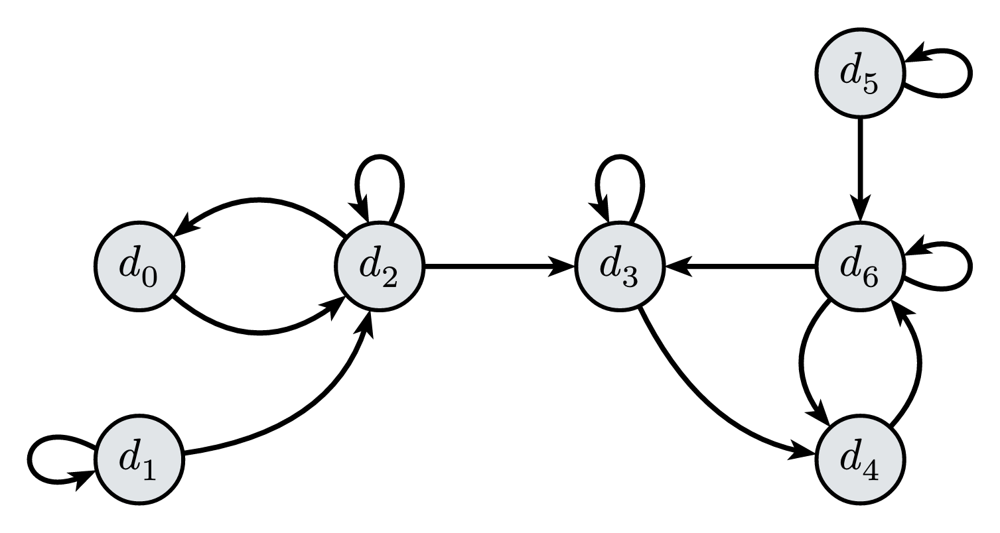 |
| [Wetterich Equation](https://janosh.github.io/diagrams/wetterich-equation) &nbsp;[![LaTeX][latex-logo]](assets/wetterich-equation/wetterich-equation.tex)&nbsp;[![Typst][typst-logo]](assets/wetterich-equation/wetterich-equation.typ) | [Which Band Gap Do You Mean?](https://janosh.github.io/diagrams/which-band-gap-do-you-mean) &nbsp;[![Typst][typst-logo]](assets/which-band-gap-do-you-mean/which-band-gap-do-you-mean.typ) |
|  | 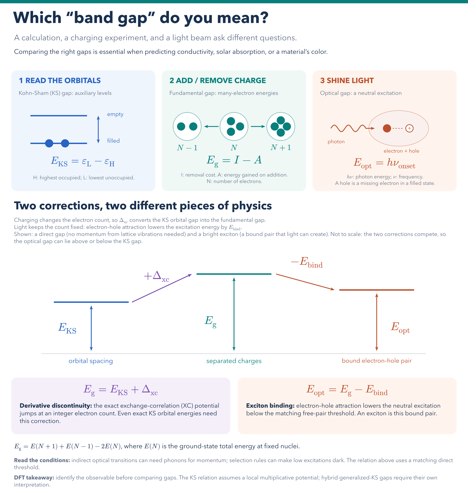 |
| [Wyckoff Positions](https://janosh.github.io/diagrams/wyckoff-positions) &nbsp;[![LaTeX][latex-logo]](assets/wyckoff-positions/wyckoff-positions.tex)&nbsp;[![Typst][typst-logo]](assets/wyckoff-positions/wyckoff-positions.typ) | [XC Functional](https://janosh.github.io/diagrams/xc-functional) &nbsp;[![Typst][typst-logo]](assets/xc-functional/xc-functional.typ) |
| 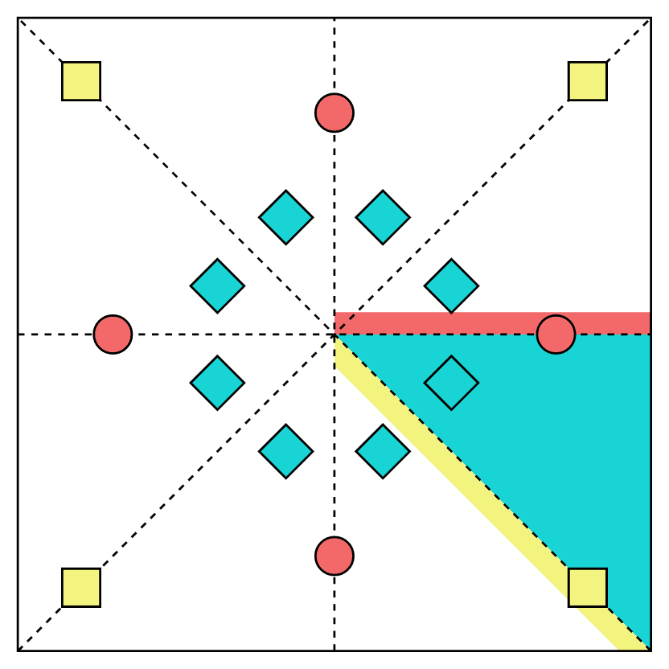 | 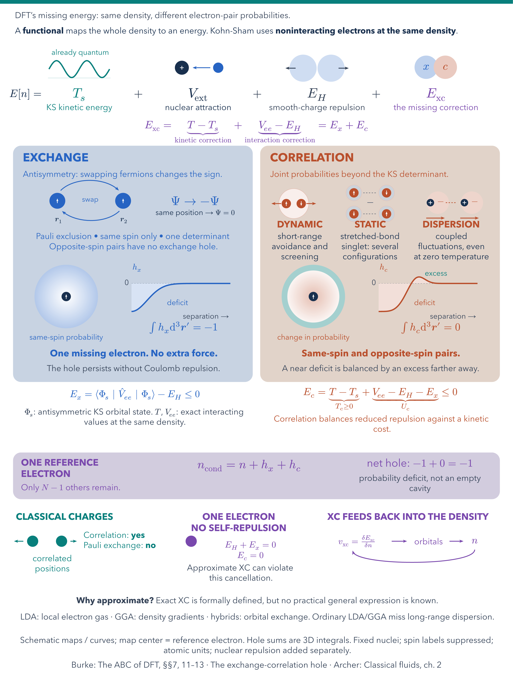 |
<!-- markdownlint-disable MD060 -->
| [zT vs n](https://janosh.github.io/diagrams/zt-vs-n) &nbsp;[![LaTeX][latex-logo]](assets/zt-vs-n/zt-vs-n.tex)&nbsp;[![Typst][typst-logo]](assets/zt-vs-n/zt-vs-n.typ) |  |
| 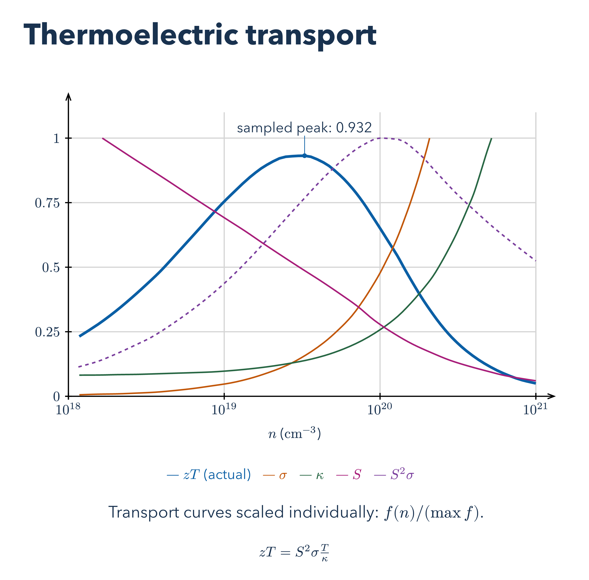 |  |
<!-- markdownlint-enable MD060 -->

## Scripts

Files in [`/scripts`](scripts) render and convert the `.typ` and `.tex` files in [`/assets`](assets) to various formats:

- low + high-res PNG
- PDF
- SVG

To run the scripts requires the following dependencies:

- [`pdf-compressor`](https://github.com/janosh/pdf-compressor) (`pip install pdf-compressor`)
- [`gs` (GhostScript)](https://ghostscript.com) (optional, worse compression but needs no API key so less setup than `pdf-compressor`)
- [`pdf2svg`](https://github.com/dawbarton/pdf2svg) (`brew install pdf2svg`)
- `convert` (part of [ImageMagick](https://imagemagick.org/script))
- [`pngquant`](https://github.com/kornelski/pngquant) (`brew install pngquant`)
- [`zopflipng`](https://github.com/google/zopfli) (`brew install zopfli`)

To run `pdf-compressor` directly or to use it as part of the [`render-(typst|tikz).py`](scripts/render_typst.py) pipeline, you need a free public API key from <https://developer.ilovepdf.com>. Pass it to `pdf-compressor` with:

```sh
pdf-compressor --set-api-key project_public_7c854a9db0...
```

## Site visual checks

The browser suite checks transparent and tall diagrams in light and dark themes, native fullscreen scrolling and exit controls, mobile source headers, and the new band diagrams. Screenshots cover diagram artwork and SVG controls; text layout is checked geometrically to avoid platform font differences.

```sh
cd site
pnpm exec playwright install --only-shell chromium
pnpm exec vp build
pnpm test:visual
```

After an intentional appearance change, run `pnpm test:visual:update` and review the changed PNGs in `site/tests/visual/screenshots` before accepting them. Missing baselines fail normal runs. CI runs visual checks on the production build before deployment and uploads screenshots and traces on failure. Use the pinned Playwright version when generating baselines.

## 📖 &thinsp; How to cite

You can cite the [Zenodo record](https://zenodo.org/badge/latestdoi/286220365) using the following BibTeX entry:

```bib
@software{riebesell_diagrams_2020,
  title = {Collection of scientific diagrams},
  author = {Riebesell, Janosh and Bringuier, Stefan},
  date = {2020-08-09},
  year = {2020},
  doi = {10.5281/zenodo.7486911},
  url = {https://github.com/janosh/diagrams},
  note = {10.5281/zenodo.7486911 - https://github.com/janosh/diagrams},
  version = {0.2.0},
  urldate = {2023-01-01}, % optional, replace with your date of access
}
```

<!-- see https://iconify.design/docs/api/svg.html#dimensions for query param docs-->

[typst-logo]: https://api.iconify.design/simple-icons:typst.svg?color=white&height=16 "Open this diagram's Typst code"
[latex-logo]: https://api.iconify.design/simple-icons:latex.svg?color=white&height=16 "Open this diagram's LaTeX code"
